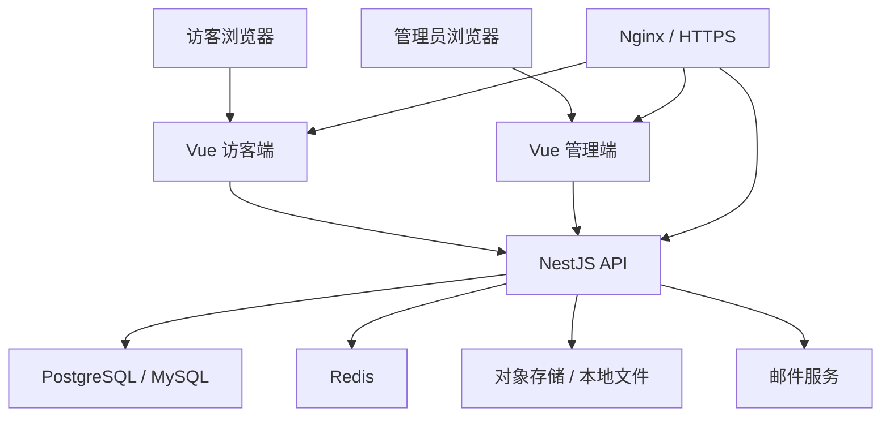

# 个人博客系统详细设计方案

## 1. 项目目标

本项目定位为一个可长期维护的个人博客系统，面向博主发布内容、访客阅读互动、管理员治理评论与内容。系统需要支持文章展示、访客登录、留言、评论回复、后台管理，并预留后续扩展能力，例如文章搜索、标签归档、邮件通知、图片管理、草稿发布、统计分析等。

你是主 Vue 的前端开发者，因此整体方案优先选择前后端 TypeScript 统一、工程结构清晰、生态成熟、学习成本可控的技术栈。

## 2. 核心需求范围

### 2.1 访客端功能

- 首页文章流：展示最新文章、置顶文章、推荐文章。
- 文章详情：展示文章正文、目录、标签、分类、阅读量、发布时间。
- 分类与标签：按分类、标签浏览文章。
- 搜索：按标题、摘要、正文关键词搜索文章。
- 访客登录：支持邮箱验证码登录、GitHub OAuth 登录、匿名昵称留言中的至少一种。
- 留言板：访客可发表独立留言。
- 文章评论：访客可在文章下评论。
- 评论回复：支持二级回复，必要时可扩展为多级树。
- 点赞：文章、评论可选支持点赞。
- 个人身份展示：访客登录后展示昵称、头像、评论历史入口。

### 2.2 管理端功能

- 管理员登录。
- 文章管理：新增、编辑、删除、发布、下线、草稿。
- Markdown 编辑器：支持预览、代码高亮、图片插入。
- 分类管理。
- 标签管理。
- 评论管理：审核、隐藏、删除、置顶、回复。
- 留言管理：审核、隐藏、删除、回复。
- 访客管理：查看访客资料、封禁异常用户。
- 系统设置：站点标题、头像、社交链接、备案信息、SEO 配置。
- 数据概览：文章数、评论数、访客数、阅读量趋势。

### 2.3 非功能需求

- 响应式布局，优先适配桌面和移动端阅读体验。
- SEO 友好，文章详情页可被搜索引擎收录。
- 安全防护：XSS、CSRF、接口限流、敏感操作鉴权。
- 数据可备份，图片与数据库分离管理。
- 可部署到云服务器、Docker、Vercel/Netlify + 独立后端等环境。
- 保持模块化，方便未来演进为 Nuxt SSR、全文搜索、评论通知等能力。

## 3. 推荐技术栈

### 3.1 前端

- Vue 3
- TypeScript
- Vite
- Vue Router
- Pinia
- TanStack Query 或 VueUse + 自定义请求层
- Element Plus 或 Naive UI 用于后台管理
- Tailwind CSS 或 UnoCSS 用于访客端样式
- Markdown 渲染：markdown-it / md-editor-v3
- 代码高亮：Shiki 或 highlight.js

说明：

- 如果强 SEO 是第一优先级，建议后续改为 Nuxt 3。
- 如果先快速实现，Vue 3 + Vite + 后端接口已经足够。
- 管理后台建议使用组件库，访客端建议做定制化视觉。

### 3.2 后端

推荐：

- Node.js
- NestJS
- TypeScript
- Prisma ORM
- PostgreSQL 或 MySQL
- Redis
- JWT + Refresh Token
- Zod 或 class-validator 做请求校验
- Swagger/OpenAPI 生成接口文档

选择理由：

- NestJS 对模块、控制器、服务、守卫、拦截器的组织很清晰。
- TypeScript 前后端统一，适合 Vue 开发者切入后端。
- Prisma 数据模型直观，迁移和类型提示体验好。
- Redis 可用于验证码、限流、会话黑名单、热点缓存。

### 3.3 数据库

优先推荐 PostgreSQL。如果你更熟悉 MySQL，也可以选 MySQL 8。

本方案表结构尽量保持数据库无关，字段类型可在 Prisma 中映射。

### 3.4 部署

- Nginx：静态资源代理、HTTPS、反向代理 API。
- Docker Compose：编排前端、后端、数据库、Redis。
- 对象存储：阿里云 OSS、腾讯云 COS、S3 或本地 MinIO。
- CI/CD：GitHub Actions 或手动部署脚本。

## 4. 总体架构



建议采用前后端分离架构：

- `web`：访客端。
- `admin`：管理后台。
- `server`：后端 API。
- `packages`：共享类型、接口声明、工具函数，可后续加入。

初期也可以将 `web` 和 `admin` 放在一个 Vue 应用里，通过路由区分 `/` 和 `/admin`。

## 5. 角色与权限

### 5.1 用户角色

- 游客：未登录用户，只能浏览文章。
- 访客：登录用户，可留言、评论、回复、点赞。
- 管理员：可管理文章、分类、标签、评论、留言、站点设置。
- 超级管理员：可管理管理员账号、系统级配置。

### 5.2 权限规则

| 操作 | 游客 | 访客 | 管理员 |
| --- | --- | --- | --- |
| 浏览文章 | 是 | 是 | 是 |
| 搜索文章 | 是 | 是 | 是 |
| 发表评论 | 否 | 是 | 是 |
| 回复评论 | 否 | 是 | 是 |
| 留言 | 否 | 是 | 是 |
| 删除自己的评论 | 否 | 可选 | 是 |
| 审核评论 | 否 | 否 | 是 |
| 发布文章 | 否 | 否 | 是 |
| 修改站点配置 | 否 | 否 | 是 |

## 6. 数据库设计

### 6.1 用户表 `users`

用于管理员和访客统一身份体系。

| 字段 | 类型 | 说明 |
| --- | --- | --- |
| id | bigint / uuid | 主键 |
| email | varchar | 邮箱，唯一，可为空 |
| username | varchar | 用户名，唯一，可为空 |
| nickname | varchar | 昵称 |
| avatar_url | varchar | 头像 |
| password_hash | varchar | 管理员密码哈希，访客可为空 |
| role | enum | visitor/admin/super_admin |
| status | enum | active/banned/deleted |
| provider | varchar | local/github/email |
| provider_id | varchar | 第三方登录 ID |
| last_login_at | datetime | 最后登录时间 |
| created_at | datetime | 创建时间 |
| updated_at | datetime | 更新时间 |

索引：

- `email` 唯一索引。
- `username` 唯一索引。
- `(provider, provider_id)` 唯一索引。
- `status` 普通索引。

### 6.2 文章表 `posts`

| 字段 | 类型 | 说明 |
| --- | --- | --- |
| id | bigint / uuid | 主键 |
| title | varchar | 标题 |
| slug | varchar | URL 友好标识，唯一 |
| summary | text | 摘要 |
| cover_url | varchar | 封面图 |
| content_md | longtext | Markdown 原文 |
| content_html | longtext | 服务端渲染后的 HTML，可选 |
| status | enum | draft/published/archived |
| visibility | enum | public/private |
| author_id | bigint / uuid | 作者 ID |
| category_id | bigint / uuid | 分类 ID |
| is_top | boolean | 是否置顶 |
| allow_comment | boolean | 是否允许评论 |
| view_count | int | 阅读数 |
| like_count | int | 点赞数 |
| comment_count | int | 评论数 |
| published_at | datetime | 发布时间 |
| created_at | datetime | 创建时间 |
| updated_at | datetime | 更新时间 |
| deleted_at | datetime | 软删除时间 |

索引：

- `slug` 唯一索引。
- `(status, published_at)` 复合索引。
- `category_id` 普通索引。
- `author_id` 普通索引。

### 6.3 分类表 `categories`

| 字段 | 类型 | 说明 |
| --- | --- | --- |
| id | bigint / uuid | 主键 |
| name | varchar | 分类名称 |
| slug | varchar | URL 标识，唯一 |
| description | text | 描述 |
| sort_order | int | 排序 |
| post_count | int | 文章数冗余 |
| created_at | datetime | 创建时间 |
| updated_at | datetime | 更新时间 |

### 6.4 标签表 `tags`

| 字段 | 类型 | 说明 |
| --- | --- | --- |
| id | bigint / uuid | 主键 |
| name | varchar | 标签名称 |
| slug | varchar | URL 标识，唯一 |
| color | varchar | 展示颜色，可选 |
| post_count | int | 文章数冗余 |
| created_at | datetime | 创建时间 |
| updated_at | datetime | 更新时间 |

### 6.5 文章标签关联表 `post_tags`

| 字段 | 类型 | 说明 |
| --- | --- | --- |
| post_id | bigint / uuid | 文章 ID |
| tag_id | bigint / uuid | 标签 ID |

主键：

- `(post_id, tag_id)`

### 6.6 评论表 `comments`

文章评论与回复统一存储。初期推荐支持二级回复，数据库结构保留多级扩展能力。

| 字段 | 类型 | 说明 |
| --- | --- | --- |
| id | bigint / uuid | 主键 |
| post_id | bigint / uuid | 文章 ID |
| user_id | bigint / uuid | 评论用户 ID |
| parent_id | bigint / uuid | 父评论 ID，一级评论为空 |
| root_id | bigint / uuid | 根评论 ID，便于查询二级回复 |
| reply_to_user_id | bigint / uuid | 被回复用户 ID |
| content | text | 评论内容 |
| content_html | text | 清洗后的 HTML，可选 |
| status | enum | pending/approved/rejected/hidden/deleted |
| ip_hash | varchar | IP 哈希，用于风控 |
| user_agent | varchar | UA 摘要 |
| like_count | int | 点赞数 |
| created_at | datetime | 创建时间 |
| updated_at | datetime | 更新时间 |
| deleted_at | datetime | 软删除时间 |

索引：

- `(post_id, status, created_at)` 用于文章评论列表。
- `(root_id, status, created_at)` 用于回复列表。
- `user_id` 用于用户评论历史。
- `parent_id` 用于回复关系。

评论策略：

- 一级评论：`parent_id = null`，`root_id = id`。
- 二级回复：`parent_id = 被回复评论 id`，`root_id = 所属一级评论 id`。
- 前端展示时以一级评论为主，每条一级评论下展示回复列表。

### 6.7 留言表 `guestbook_messages`

留言板与文章评论分开，便于管理和展示。

| 字段 | 类型 | 说明 |
| --- | --- | --- |
| id | bigint / uuid | 主键 |
| user_id | bigint / uuid | 留言用户 ID |
| parent_id | bigint / uuid | 父留言 ID，用于回复 |
| root_id | bigint / uuid | 根留言 ID |
| reply_to_user_id | bigint / uuid | 被回复用户 |
| content | text | 留言内容 |
| status | enum | pending/approved/rejected/hidden/deleted |
| ip_hash | varchar | IP 哈希 |
| user_agent | varchar | UA 摘要 |
| like_count | int | 点赞数 |
| created_at | datetime | 创建时间 |
| updated_at | datetime | 更新时间 |
| deleted_at | datetime | 软删除时间 |

### 6.8 点赞表 `likes`

| 字段 | 类型 | 说明 |
| --- | --- | --- |
| id | bigint / uuid | 主键 |
| user_id | bigint / uuid | 用户 ID |
| target_type | enum | post/comment/message |
| target_id | bigint / uuid | 目标 ID |
| created_at | datetime | 创建时间 |

唯一索引：

- `(user_id, target_type, target_id)`

### 6.9 登录会话表 `refresh_tokens`

| 字段 | 类型 | 说明 |
| --- | --- | --- |
| id | bigint / uuid | 主键 |
| user_id | bigint / uuid | 用户 ID |
| token_hash | varchar | Refresh Token 哈希 |
| expires_at | datetime | 过期时间 |
| revoked_at | datetime | 撤销时间 |
| created_at | datetime | 创建时间 |

### 6.10 邮箱验证码表 `email_verification_codes`

也可以只放 Redis，数据库表用于审计。

| 字段 | 类型 | 说明 |
| --- | --- | --- |
| id | bigint / uuid | 主键 |
| email | varchar | 邮箱 |
| code_hash | varchar | 验证码哈希 |
| scene | enum | login/bind_email/reset_password |
| expires_at | datetime | 过期时间 |
| used_at | datetime | 使用时间 |
| created_at | datetime | 创建时间 |

### 6.11 附件表 `assets`

| 字段 | 类型 | 说明 |
| --- | --- | --- |
| id | bigint / uuid | 主键 |
| uploader_id | bigint / uuid | 上传者 |
| url | varchar | 访问地址 |
| storage_key | varchar | 存储路径 |
| mime_type | varchar | MIME 类型 |
| size | int | 文件大小 |
| width | int | 图片宽度 |
| height | int | 图片高度 |
| created_at | datetime | 创建时间 |

### 6.12 站点配置表 `site_settings`

| 字段 | 类型 | 说明 |
| --- | --- | --- |
| key | varchar | 配置键，主键 |
| value | json/text | 配置值 |
| description | varchar | 描述 |
| updated_at | datetime | 更新时间 |

## 7. 后端模块设计

### 7.1 模块划分

```text
server/src
  app.module.ts
  common/
    guards/
    decorators/
    filters/
    interceptors/
    pipes/
  modules/
    auth/
    users/
    posts/
    categories/
    tags/
    comments/
    guestbook/
    likes/
    assets/
    settings/
    admin/
  prisma/
  config/
```

### 7.2 认证模块 `auth`

能力：

- 管理员账号密码登录。
- 访客邮箱验证码登录。
- GitHub OAuth 登录，可作为第二阶段。
- JWT Access Token。
- Refresh Token 续期。
- 退出登录。
- 当前用户信息 `/auth/me`。

Token 策略：

- Access Token：短有效期，例如 15 分钟。
- Refresh Token：长有效期，例如 7 到 30 天。
- Refresh Token 存库哈希，支持吊销。

### 7.3 文章模块 `posts`

能力：

- 访客端文章列表。
- 访客端文章详情。
- 按分类、标签、关键词筛选。
- 管理端 CRUD。
- 发布、下线、置顶。
- 阅读数计数。
- 文章预览。

注意：

- 阅读数建议做简单防刷：同一 IP / User-Agent / 文章在短时间内只计一次。
- 后台编辑 Markdown 时保存 `content_md`，前台渲染时可服务端转换为安全 HTML。

### 7.4 评论模块 `comments`

能力：

- 获取文章评论树。
- 创建评论。
- 回复评论。
- 删除自己的评论，可选。
- 管理员审核、隐藏、删除。
- 管理员回复。

审核策略：

- 初期可以默认 `approved`，但对包含敏感词、链接过多、频率异常的评论设置为 `pending`。
- 后台提供审核队列。

### 7.5 留言模块 `guestbook`

能力：

- 获取留言列表。
- 创建留言。
- 回复留言。
- 管理端审核、隐藏、删除。

留言与评论逻辑相似，但不依赖文章。

### 7.6 附件模块 `assets`

能力：

- 管理员上传文章封面和文章图片。
- 校验文件类型、大小。
- 返回可访问 URL。
- 支持本地开发存储和线上对象存储切换。

### 7.7 管理模块 `admin`

管理端接口可复用业务模块，也可以通过 `/admin/*` 聚合。

建议：

- 前台接口与后台接口分开路由。
- 后台接口统一要求 `admin` 或 `super_admin` 角色。
- 后台列表查询支持筛选、分页、排序。

## 8. API 设计草案

统一响应格式：

```json
{
  "code": 0,
  "message": "ok",
  "data": {}
}
```

分页响应：

```json
{
  "items": [],
  "page": 1,
  "pageSize": 20,
  "total": 100
}
```

### 8.1 认证接口

| 方法 | 路径 | 说明 | 权限 |
| --- | --- | --- | --- |
| POST | `/api/auth/admin/login` | 管理员登录 | 无 |
| POST | `/api/auth/email/code` | 发送邮箱验证码 | 无 |
| POST | `/api/auth/email/login` | 邮箱验证码登录 | 无 |
| POST | `/api/auth/refresh` | 刷新 Token | 登录 |
| POST | `/api/auth/logout` | 退出登录 | 登录 |
| GET | `/api/auth/me` | 当前用户 | 登录 |

### 8.2 文章接口

| 方法 | 路径 | 说明 | 权限 |
| --- | --- | --- | --- |
| GET | `/api/posts` | 文章列表 | 无 |
| GET | `/api/posts/:slug` | 文章详情 | 无 |
| POST | `/api/admin/posts` | 创建文章 | 管理员 |
| GET | `/api/admin/posts` | 后台文章列表 | 管理员 |
| GET | `/api/admin/posts/:id` | 后台文章详情 | 管理员 |
| PATCH | `/api/admin/posts/:id` | 更新文章 | 管理员 |
| DELETE | `/api/admin/posts/:id` | 删除文章 | 管理员 |
| POST | `/api/admin/posts/:id/publish` | 发布文章 | 管理员 |
| POST | `/api/admin/posts/:id/archive` | 下线文章 | 管理员 |

### 8.3 分类与标签接口

| 方法 | 路径 | 说明 | 权限 |
| --- | --- | --- | --- |
| GET | `/api/categories` | 分类列表 | 无 |
| GET | `/api/tags` | 标签列表 | 无 |
| POST | `/api/admin/categories` | 创建分类 | 管理员 |
| PATCH | `/api/admin/categories/:id` | 更新分类 | 管理员 |
| DELETE | `/api/admin/categories/:id` | 删除分类 | 管理员 |
| POST | `/api/admin/tags` | 创建标签 | 管理员 |
| PATCH | `/api/admin/tags/:id` | 更新标签 | 管理员 |
| DELETE | `/api/admin/tags/:id` | 删除标签 | 管理员 |

### 8.4 评论接口

| 方法 | 路径 | 说明 | 权限 |
| --- | --- | --- | --- |
| GET | `/api/posts/:postId/comments` | 文章评论列表 | 无 |
| POST | `/api/posts/:postId/comments` | 创建评论 | 访客 |
| POST | `/api/comments/:id/replies` | 回复评论 | 访客 |
| DELETE | `/api/comments/:id` | 删除自己的评论 | 作者或管理员 |
| GET | `/api/admin/comments` | 后台评论列表 | 管理员 |
| PATCH | `/api/admin/comments/:id/status` | 更新评论状态 | 管理员 |
| DELETE | `/api/admin/comments/:id` | 管理员删除评论 | 管理员 |

### 8.5 留言接口

| 方法 | 路径 | 说明 | 权限 |
| --- | --- | --- | --- |
| GET | `/api/guestbook/messages` | 留言列表 | 无 |
| POST | `/api/guestbook/messages` | 创建留言 | 访客 |
| POST | `/api/guestbook/messages/:id/replies` | 回复留言 | 访客 |
| GET | `/api/admin/guestbook/messages` | 后台留言列表 | 管理员 |
| PATCH | `/api/admin/guestbook/messages/:id/status` | 更新留言状态 | 管理员 |
| DELETE | `/api/admin/guestbook/messages/:id` | 删除留言 | 管理员 |

### 8.6 点赞接口

| 方法 | 路径 | 说明 | 权限 |
| --- | --- | --- | --- |
| POST | `/api/likes` | 点赞 | 访客 |
| DELETE | `/api/likes` | 取消点赞 | 访客 |

请求示例：

```json
{
  "targetType": "post",
  "targetId": "1"
}
```

## 9. 前端设计

### 9.1 应用结构

建议初期一个仓库三部分：

```text
myblog
  apps/
    web/
    admin/
    server/
  packages/
    shared/
  docker-compose.yml
  README.md
```

如果想降低初期复杂度，也可以：

```text
myblog
  web/
  server/
```

其中 `web` 内通过路由承载访客端和管理端。

### 9.2 访客端页面

| 页面 | 路由 | 说明 |
| --- | --- | --- |
| 首页 | `/` | 文章流、推荐、分类入口 |
| 文章详情 | `/posts/:slug` | 正文、目录、评论 |
| 分类页 | `/categories/:slug` | 分类文章 |
| 标签页 | `/tags/:slug` | 标签文章 |
| 归档页 | `/archives` | 按年份月份展示 |
| 搜索页 | `/search` | 关键词搜索 |
| 留言板 | `/guestbook` | 留言和回复 |
| 关于页 | `/about` | 个人介绍 |
| 登录弹窗/页 | `/login` | 访客登录 |

### 9.3 管理端页面

| 页面 | 路由 | 说明 |
| --- | --- | --- |
| 登录 | `/admin/login` | 管理员登录 |
| 仪表盘 | `/admin` | 数据概览 |
| 文章列表 | `/admin/posts` | 筛选、发布状态 |
| 文章编辑 | `/admin/posts/new`, `/admin/posts/:id/edit` | Markdown 编辑 |
| 分类管理 | `/admin/categories` | CRUD |
| 标签管理 | `/admin/tags` | CRUD |
| 评论管理 | `/admin/comments` | 审核、隐藏、删除 |
| 留言管理 | `/admin/guestbook` | 审核、回复 |
| 访客管理 | `/admin/users` | 查看、封禁 |
| 系统设置 | `/admin/settings` | 站点配置 |

### 9.4 前端模块划分

```text
web/src
  app/
    router/
    stores/
    providers/
  assets/
  components/
    layout/
    post/
    comment/
    auth/
  composables/
  pages/
  services/
    http.ts
    auth.api.ts
    post.api.ts
    comment.api.ts
  types/
  utils/
```

后台如果独立：

```text
admin/src
  app/
  components/
  layouts/
  pages/
  services/
  stores/
  types/
```

### 9.5 前端状态管理

Pinia Store：

- `useAuthStore`：用户信息、登录状态、Token 管理。
- `useSiteStore`：站点配置、主题、导航。
- `useAdminStore`：后台布局状态、菜单折叠、权限信息。

服务端数据：

- 推荐 TanStack Query 管理列表、详情、缓存、刷新。
- 简单项目也可以先用 `services/*.api.ts` + 组件内加载状态。

### 9.6 评论组件设计

组件：

- `CommentList`
- `CommentItem`
- `CommentEditor`
- `ReplyList`
- `LoginPrompt`

交互：

- 未登录点击评论框，弹出登录。
- 登录后可输入评论。
- 回复时评论框定位到对应评论下方。
- 评论提交后根据审核策略显示为“已发布”或“待审核”。
- 后端返回评论树或一级评论 + replies。

评论列表接口建议返回：

```json
{
  "items": [
    {
      "id": "1",
      "content": "一级评论",
      "user": {
        "id": "10",
        "nickname": "访客 A",
        "avatarUrl": ""
      },
      "createdAt": "2026-05-12T10:00:00Z",
      "replies": [
        {
          "id": "2",
          "content": "回复内容",
          "replyToUser": {
            "id": "10",
            "nickname": "访客 A"
          }
        }
      ]
    }
  ],
  "total": 1
}
```

## 10. 安全设计

### 10.1 XSS 防护

- 评论、留言内容只允许纯文本或极少量安全标签。
- Markdown 渲染后必须经过 HTML sanitizer。
- 前端使用 `v-html` 时必须确认内容已在服务端清洗。
- 用户昵称、评论内容展示默认走文本转义。

### 10.2 接口限流

需要限流的接口：

- 发送邮箱验证码。
- 登录。
- 发表评论。
- 回复评论。
- 留言。
- 点赞。

限流维度：

- IP。
- 用户 ID。
- 邮箱。
- 设备指纹可选。

### 10.3 CSRF 与 Token

如果 Token 放 localStorage：

- 实现简单，但更注意 XSS。

如果 Token 放 HttpOnly Cookie：

- 更安全，但需要 CSRF Token 或 SameSite 策略。

初期建议：

- Access Token 存内存或 Pinia。
- Refresh Token 放 HttpOnly Cookie。
- 请求失败后自动刷新 Access Token。

### 10.4 内容审核

基础策略：

- 敏感词过滤。
- 评论包含链接数量限制。
- 新用户短时间内评论频率限制。
- 管理端审核队列。

## 11. SEO 与性能

### 11.1 SEO

如果使用纯 Vue SPA：

- 动态设置标题、描述、Open Graph。
- 提供 sitemap.xml。
- 提供 robots.txt。
- 文章详情页 SEO 不如 SSR，但个人博客初期可接受。

如果使用 Nuxt 3：

- 文章详情可 SSR/SSG。
- SEO 更完整。
- 后续可把访客端迁移到 Nuxt，管理端保留 Vite SPA。

建议路线：

1. 初期用 Vue 3 + Vite 快速实现。
2. 内容稳定后，把访客端升级为 Nuxt 3。
3. 管理后台继续使用 Vite SPA。

### 11.2 性能

- 文章列表分页。
- 评论分页或按需加载回复。
- 热门文章、分类、标签缓存到 Redis。
- 图片使用对象存储 CDN。
- Markdown HTML 可预渲染后存库，减少运行时开销。
- 后台大列表使用分页，不做一次性全量加载。

## 12. 部署方案

### 12.1 开发环境

```text
Vue Web       http://localhost:5173
Vue Admin     http://localhost:5174
NestJS API    http://localhost:3000
PostgreSQL    localhost:5432
Redis         localhost:6379
```

### 12.2 生产环境

```text
https://your-domain.com           访客端
https://your-domain.com/admin     管理端
https://your-domain.com/api       后端 API
```

Nginx 路由：

- `/` 指向访客端静态资源。
- `/admin` 指向管理端静态资源。
- `/api` 反向代理到 NestJS。
- `/uploads` 指向本地静态文件或对象存储代理。

### 12.3 Docker Compose 服务

- `server`
- `postgres`
- `redis`
- `nginx`
- 可选 `minio`

## 13. 开发里程碑

### 阶段一：MVP

目标：可发布文章，访客能登录、评论、留言。

- 初始化前端、后端项目。
- 实现用户、认证、文章、分类、标签基础表。
- 实现管理员登录。
- 实现文章 CRUD。
- 实现访客文章列表和详情。
- 实现邮箱验证码登录。
- 实现文章评论和回复。
- 实现留言板。
- 实现基础后台评论管理。

### 阶段二：体验完善

- Markdown 编辑器增强。
- 图片上传。
- 文章目录。
- 代码高亮。
- 文章搜索。
- 标签归档。
- 评论审核队列。
- 站点配置后台化。
- 移动端体验优化。

### 阶段三：工程化与上线

- Docker Compose。
- Nginx 配置。
- HTTPS。
- 数据库备份脚本。
- 日志与异常监控。
- 限流与安全加固。
- sitemap.xml 与 robots.txt。

### 阶段四：增强能力

- GitHub OAuth 登录。
- 邮件通知评论回复。
- RSS。
- 全文搜索，使用 PostgreSQL tsvector、Meilisearch 或 Elasticsearch。
- 访客个人中心。
- 数据统计面板。
- Nuxt 3 SSR/SSG 访客端。

## 14. 推荐目录落地方案

考虑到你主 Vue，建议初期采用下面结构：

```text
myblog
  apps
    web
      src
    admin
      src
    server
      src
  packages
    shared
      src
  prisma
    schema.prisma
    migrations
  docs
  docker
  docker-compose.yml
  package.json
  pnpm-workspace.yaml
  README.md
```

包管理建议：

- pnpm workspace。
- 前端、后台、后端统一 TypeScript。
- `packages/shared` 放共享类型，例如 API DTO、枚举、工具函数。

## 15. Prisma 模型草案

以下是简化模型，用于后续建库时参考：

```prisma
model User {
  id           String   @id @default(cuid())
  email        String?  @unique
  username     String?  @unique
  nickname     String
  avatarUrl    String?
  passwordHash String?
  role         UserRole @default(VISITOR)
  status       UserStatus @default(ACTIVE)
  provider     String?
  providerId   String?
  lastLoginAt  DateTime?
  createdAt    DateTime @default(now())
  updatedAt    DateTime @updatedAt

  posts        Post[]
  comments     Comment[]
  messages     GuestbookMessage[]
}

model Post {
  id           String   @id @default(cuid())
  title        String
  slug         String   @unique
  summary      String?
  coverUrl     String?
  contentMd    String
  contentHtml  String?
  status       PostStatus @default(DRAFT)
  visibility   Visibility @default(PUBLIC)
  authorId     String
  categoryId   String?
  isTop        Boolean @default(false)
  allowComment Boolean @default(true)
  viewCount    Int @default(0)
  likeCount    Int @default(0)
  commentCount Int @default(0)
  publishedAt  DateTime?
  createdAt    DateTime @default(now())
  updatedAt    DateTime @updatedAt
  deletedAt    DateTime?

  author       User @relation(fields: [authorId], references: [id])
  category     Category? @relation(fields: [categoryId], references: [id])
  tags         PostTag[]
  comments     Comment[]

  @@index([status, publishedAt])
  @@index([categoryId])
}

model Category {
  id          String @id @default(cuid())
  name        String
  slug        String @unique
  description String?
  sortOrder   Int @default(0)
  postCount   Int @default(0)
  createdAt   DateTime @default(now())
  updatedAt   DateTime @updatedAt

  posts       Post[]
}

model Tag {
  id        String @id @default(cuid())
  name      String
  slug      String @unique
  color     String?
  postCount Int @default(0)
  createdAt DateTime @default(now())
  updatedAt DateTime @updatedAt

  posts     PostTag[]
}

model PostTag {
  postId String
  tagId  String

  post   Post @relation(fields: [postId], references: [id])
  tag    Tag  @relation(fields: [tagId], references: [id])

  @@id([postId, tagId])
}

model Comment {
  id            String @id @default(cuid())
  postId        String
  userId        String
  parentId      String?
  rootId        String?
  replyToUserId String?
  content       String
  contentHtml   String?
  status        ContentStatus @default(APPROVED)
  ipHash        String?
  userAgent     String?
  likeCount     Int @default(0)
  createdAt     DateTime @default(now())
  updatedAt     DateTime @updatedAt
  deletedAt     DateTime?

  post          Post @relation(fields: [postId], references: [id])
  user          User @relation(fields: [userId], references: [id])

  @@index([postId, status, createdAt])
  @@index([rootId, status, createdAt])
  @@index([userId])
}

model GuestbookMessage {
  id            String @id @default(cuid())
  userId        String
  parentId      String?
  rootId        String?
  replyToUserId String?
  content       String
  status        ContentStatus @default(APPROVED)
  ipHash        String?
  userAgent     String?
  likeCount     Int @default(0)
  createdAt     DateTime @default(now())
  updatedAt     DateTime @updatedAt
  deletedAt     DateTime?

  user          User @relation(fields: [userId], references: [id])

  @@index([rootId, status, createdAt])
  @@index([userId])
}

model Like {
  id         String @id @default(cuid())
  userId     String
  targetType LikeTargetType
  targetId   String
  createdAt  DateTime @default(now())

  @@unique([userId, targetType, targetId])
}

enum UserRole {
  VISITOR
  ADMIN
  SUPER_ADMIN
}

enum UserStatus {
  ACTIVE
  BANNED
  DELETED
}

enum PostStatus {
  DRAFT
  PUBLISHED
  ARCHIVED
}

enum Visibility {
  PUBLIC
  PRIVATE
}

enum ContentStatus {
  PENDING
  APPROVED
  REJECTED
  HIDDEN
  DELETED
}

enum LikeTargetType {
  POST
  COMMENT
  MESSAGE
}
```

## 16. 关键实现细节建议

### 16.1 访客登录方式

MVP 推荐邮箱验证码登录：

- 无需访客记密码。
- 评论身份相对可信。
- 管理端可以封禁异常邮箱用户。

可选匿名留言：

- 输入昵称和邮箱即可评论。
- 实现更轻，但垃圾评论风险更高。

建议：

1. MVP 先做邮箱验证码登录。
2. 后续加入 GitHub OAuth。
3. 是否允许匿名留言作为站点配置项。

### 16.2 回复层级

建议产品上只展示二级回复：

- 阅读体验清楚。
- 数据库通过 `root_id` 保留扩展能力。
- 复杂讨论不适合个人博客评论区。

### 16.3 评论审核

初期配置：

- 管理员自己的回复直接通过。
- 登录访客评论默认通过。
- 命中敏感词、链接过多、短时间高频评论进入待审核。
- 被封禁用户不能评论。

### 16.4 Markdown 内容安全

- 文章内容由管理员发布，可信度较高，但仍建议 sanitize。
- 评论和留言只允许纯文本，换行转换为 `<br>` 即可。
- 不允许访客提交 HTML。

### 16.5 错误码

建议定义统一错误码：

| 错误码 | 说明 |
| --- | --- |
| 0 | 成功 |
| 40001 | 参数错误 |
| 40101 | 未登录 |
| 40301 | 权限不足 |
| 40401 | 资源不存在 |
| 40901 | 资源冲突 |
| 42901 | 请求过于频繁 |
| 50001 | 服务端错误 |

## 17. 测试策略

### 17.1 后端测试

- Auth：登录、刷新、退出。
- Posts：发布、下线、访客只看已发布。
- Comments：评论、回复、审核状态过滤。
- Guestbook：留言、回复、审核。
- Permissions：访客不能访问后台接口。

### 17.2 前端测试

- 登录弹窗流程。
- 文章详情加载状态、空状态、错误状态。
- 评论提交和回复交互。
- 后台文章编辑保存。
- 后台评论审核操作。

### 17.3 E2E 测试

核心链路：

1. 管理员登录。
2. 创建并发布文章。
3. 访客打开文章。
4. 访客邮箱登录。
5. 访客发表评论。
6. 管理员在后台查看并管理评论。

## 18. 后续执行建议

建议下一步从 MVP 工程骨架开始：

1. 初始化 pnpm monorepo。
2. 创建 `apps/web`、`apps/admin`、`apps/server`。
3. 配置 ESLint、Prettier、TypeScript。
4. 配置 Docker Compose 的 PostgreSQL 和 Redis。
5. 建立 Prisma schema 并生成首个 migration。
6. 先实现认证和文章模块。
7. 再实现评论、留言、后台管理。

## 19. 需要提前确认的问题

- 是否必须强 SEO？如果必须，访客端直接选 Nuxt 3。
- 访客登录是否只支持邮箱验证码，还是要 GitHub OAuth？
- 评论是否需要管理员审核后展示？
- 图片准备存本地服务器还是对象存储？
- 数据库你更偏好 PostgreSQL 还是 MySQL？
- 管理后台要独立应用，还是和访客端放在同一个 Vue 应用？

## 20. 推荐 MVP 决策

如果没有额外限制，推荐默认方案：

- 前端：Vue 3 + Vite + TypeScript。
- 管理端：Vue 3 + Vite + TypeScript + Element Plus。
- 后端：NestJS + Prisma。
- 数据库：PostgreSQL。
- 缓存：Redis。
- 登录：管理员账号密码，访客邮箱验证码。
- 评论：登录后可评论，默认展示，命中风险规则进入审核。
- 回复：二级回复。
- 部署：Docker Compose + Nginx。

这个组合的优势是学习曲线友好、工程结构清楚、后期扩展空间足够，也适合你从 Vue 前端逐步进入全栈实现。
