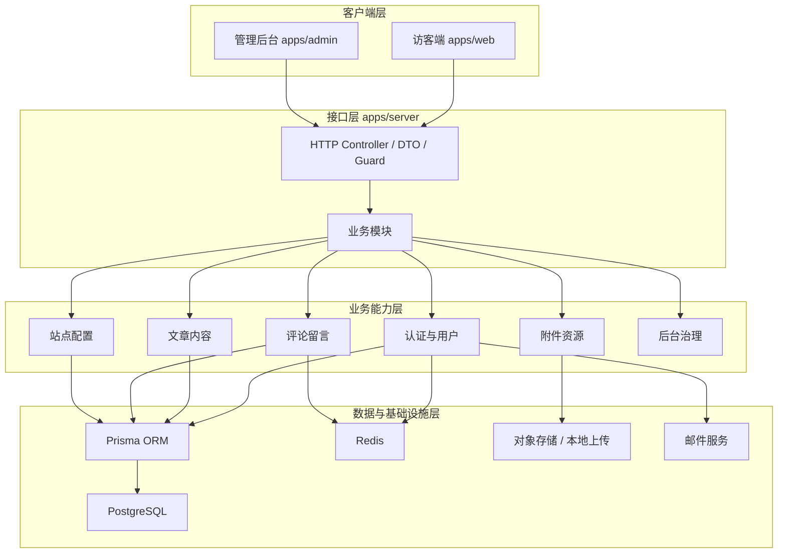
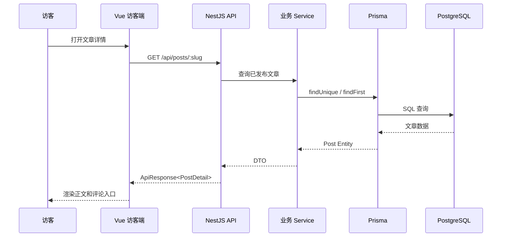
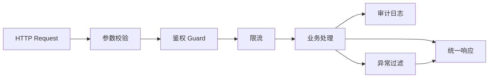

# 模块设计总览

## 1. 文档目标

本文档用于描述个人博客系统的模块边界、整体架构、调用关系和设计取舍。更细的模块设计分别放在同目录下的专题文档中。

## 2. 系统分层

## 3. 模块划分原则

- 以业务能力划分，而不是以数据库表划分。
- 访客端和管理端共享同一套后端业务能力，但通过路由、权限和 DTO 区分使用场景。
- 核心内容模型保持简单，复杂能力通过后续模块扩展。
- 写路径优先保证一致性，读路径可以逐步加缓存和搜索索引。
- 评论、留言、点赞等互动模块都必须考虑风控和审核。

## 4. 模块清单

| 模块 | 代码位置 | 主要职责 |
| --- | --- | --- |
| 认证与用户 | `apps/server/src/modules/auth`, `users` | 登录、Token、访客身份、管理员权限 |
| 文章内容 | `apps/server/src/modules/posts`, `categories`, `tags` | 文章发布、查询、分类、标签、归档 |
| 评论与留言 | `apps/server/src/modules/comments`, `guestbook` | 评论、回复、留言、审核、删除 |
| 管理后台 | `apps/admin`, `apps/server/src/modules/admin` | 内容治理、站点配置、数据看板 |
| 前端访客端 | `apps/web` | 文章阅读、搜索、登录、互动 |
| 共享包 | `packages/shared` | 枚举、接口类型、共享常量 |
| 数据模型 | `prisma/schema.prisma` | 数据库表、关系、索引 |
| 基础设施 | `docker-compose.yml`, `docker/` | 数据库、Redis、Nginx、部署 |

## 5. 请求链路

## 6. 设计原因

### 6.1 为什么前后端分离

个人博客后续会同时有访客端、管理端、开放 API、可能的移动端。前后端分离能让访客端专注阅读体验，管理端专注运营效率，后端专注数据和权限边界。

### 6.2 为什么采用 NestJS

NestJS 的模块、控制器、服务、守卫、拦截器结构适合中长期维护。对于 Vue 开发者来说，前后端都用 TypeScript，类型迁移和上下文切换成本较低。

### 6.3 为什么管理端独立

管理后台依赖 Element Plus、表格、表单、审核操作等组件，包体积和交互形态都与访客端不同。独立应用可以避免访客端加载后台依赖，也方便未来独立鉴权和部署。

### 6.4 为什么先不强上 SSR

MVP 阶段重点是内容管理、登录、评论和留言闭环。Vue SPA 可以更快落地。后续当文章规模、SEO 要求提高时，访客端可迁移到 Nuxt 3，管理端保持 SPA。

## 7. 横切能力

横切能力包括：

- 统一响应格式。
- 参数校验。
- JWT 鉴权。
- 角色权限。
- 接口限流。
- 异常过滤。
- 操作审计。
- 日志与监控。

## 8. 推荐开发顺序

1. 数据模型与 Prisma migration。
2. 认证与用户模块。
3. 文章、分类、标签模块。
4. 访客端文章列表和详情。
5. 评论与留言模块。
6. 管理后台治理能力。
7. 限流、审核、安全加固。
8. 部署、备份、监控。
