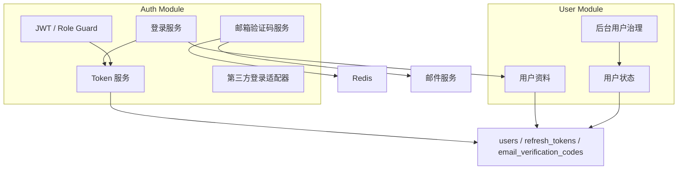
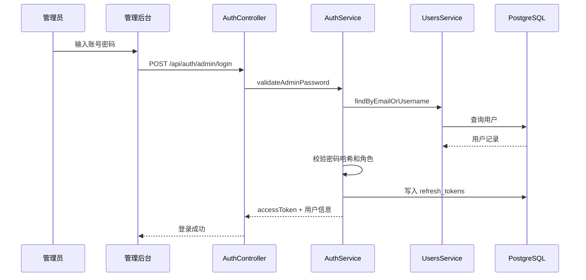
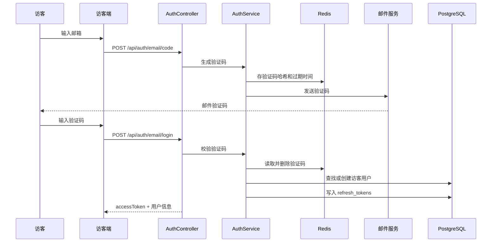
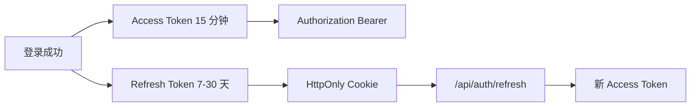

# 认证与用户模块设计

## 1. 模块目标

认证与用户模块负责建立系统身份体系，支持访客登录、管理员登录、Token 刷新、退出登录、角色权限和用户状态治理。

## 2. 模块边界

## 3. 核心职责

### 3.1 Auth Module

- 管理员账号密码登录。
- 访客邮箱验证码登录。
- Refresh Token 续期。
- 退出登录并吊销 Refresh Token。
- 解析当前登录用户。
- 提供 JWT Guard 和 Role Guard。
- 后续扩展 GitHub OAuth。

### 3.2 User Module

- 创建访客用户。
- 查询当前用户资料。
- 更新昵称、头像。
- 管理员查看用户列表。
- 封禁、解封用户。
- 用户状态判断。

## 4. 登录方式设计

### 4.1 管理员登录

设计原因：

- 管理员登录使用密码，便于本地化和私有部署。
- 密码只存哈希，推荐 `argon2` 或 `bcrypt`。
- 管理员必须校验 `role` 和 `status`，避免普通访客进入后台。

### 4.2 访客邮箱验证码登录

设计原因：

- 访客无需记密码，评论门槛低。
- 邮箱能建立相对稳定身份，便于回复通知和封禁治理。
- 验证码放 Redis，天然支持过期和限流；数据库表可作为审计补充。

## 5. Token 策略

推荐策略：

- Access Token 短有效期，前端内存保存。
- Refresh Token 长有效期，存 HttpOnly Cookie。
- Refresh Token 数据库存哈希，支持退出登录和多端管理。
- 管理端敏感操作可要求更短有效期或二次确认。

## 6. 权限模型

| 角色 | 用途 | 典型权限 |
| --- | --- | --- |
| `VISITOR` | 登录访客 | 评论、留言、点赞 |
| `ADMIN` | 博主或运营账号 | 内容管理、评论审核、用户治理 |
| `SUPER_ADMIN` | 系统所有者 | 管理管理员、系统配置 |

权限判断分两层：

- 路由级：Guard 判断是否登录、是否具有角色。
- 业务级：Service 判断资源所有者、用户状态、内容状态。

## 7. 数据模型依赖

主要表：

- `users`
- `refresh_tokens`
- `email_verification_codes`

关键索引：

- `users.email`
- `users.username`
- `users(provider, provider_id)`
- `refresh_tokens.user_id`
- `email_verification_codes(email, scene)`

## 8. 接口草案

| 方法 | 路径 | 说明 |
| --- | --- | --- |
| `POST` | `/api/auth/admin/login` | 管理员登录 |
| `POST` | `/api/auth/email/code` | 发送邮箱验证码 |
| `POST` | `/api/auth/email/login` | 访客邮箱登录 |
| `POST` | `/api/auth/refresh` | 刷新 Access Token |
| `POST` | `/api/auth/logout` | 退出登录 |
| `GET` | `/api/auth/me` | 当前用户 |
| `GET` | `/api/admin/users` | 后台用户列表 |
| `PATCH` | `/api/admin/users/:id/status` | 修改用户状态 |

## 9. 风险与防护

- 验证码接口必须限流：按 IP、邮箱、场景限制。
- 管理员登录必须限制失败次数。
- Refresh Token 必须可吊销。
- 用户被封禁后，已有 Token 应在业务层被拒绝。
- 不要把密码哈希、Token 哈希返回到前端。
- OAuth 账号绑定时要处理邮箱重复和 provider 重复。

## 10. 后续演进

- GitHub OAuth。
- 邮件回复通知。
- 多设备登录管理。
- 管理员操作二次验证。
- 用户个人中心。
- Passkey 登录。
