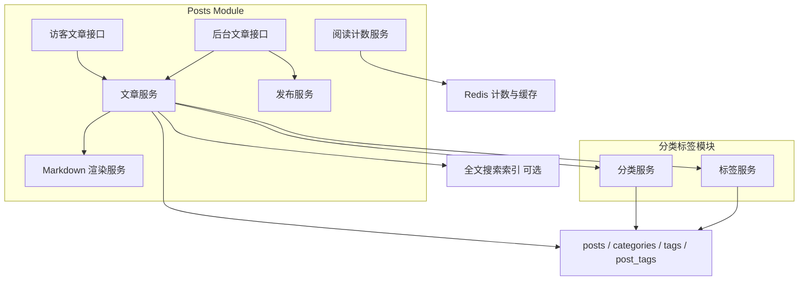
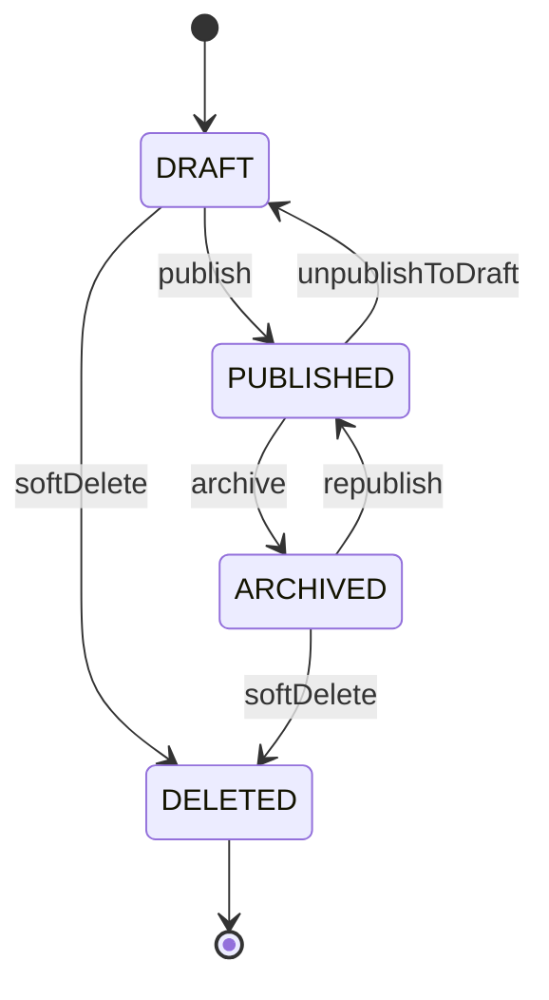
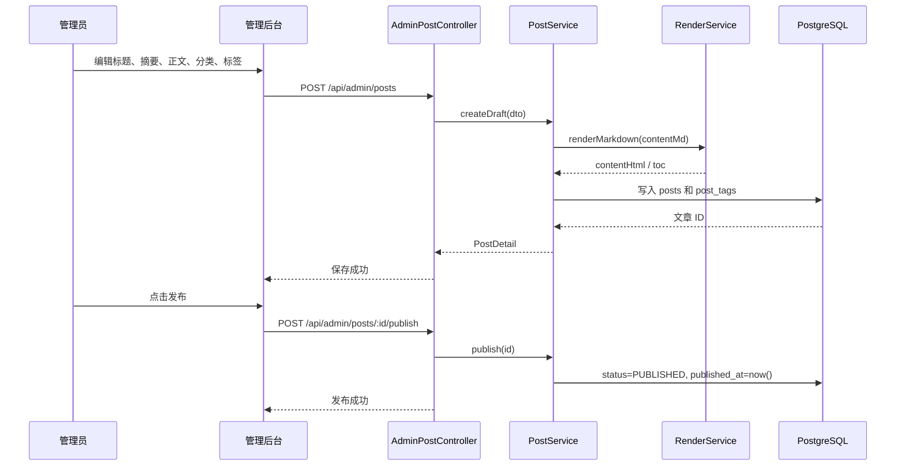
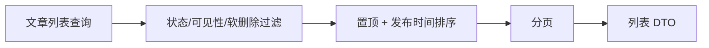
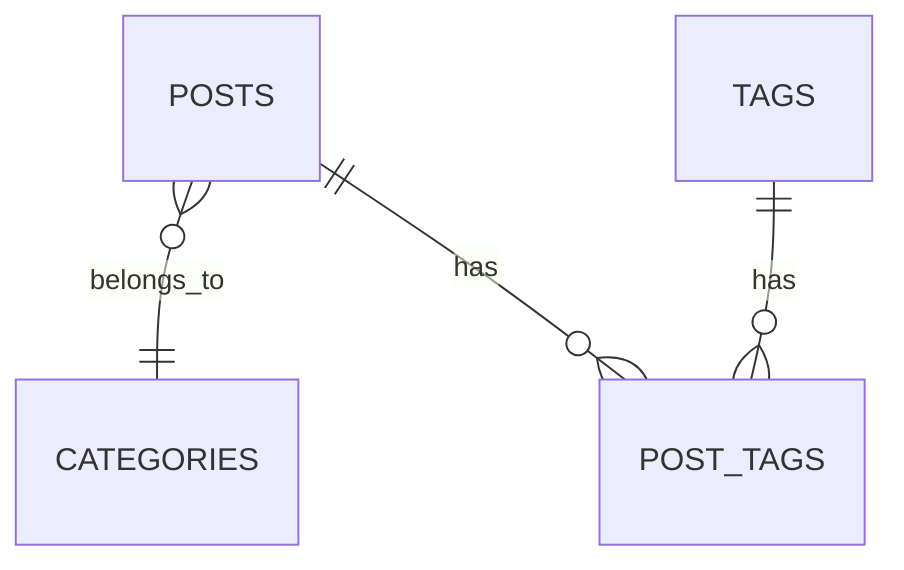
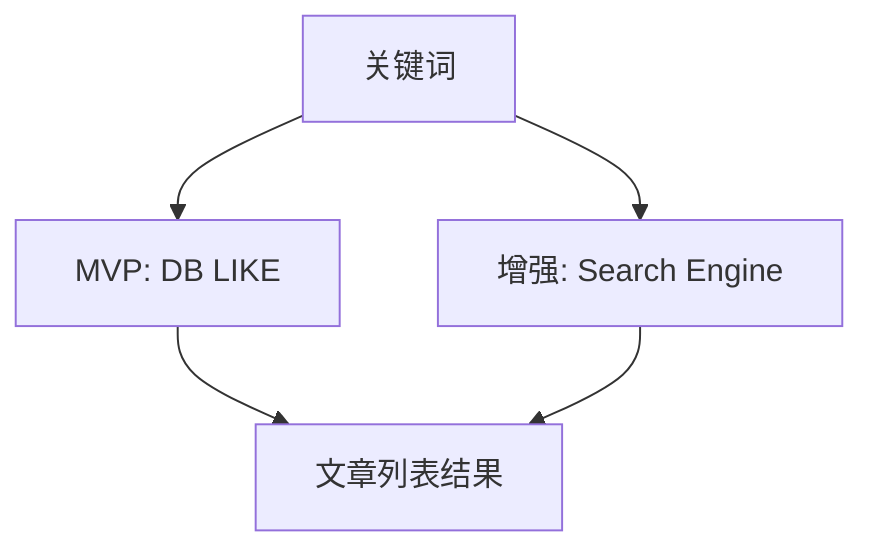

# 文章内容模块设计

## 1. 模块目标

文章内容模块负责博客的核心内容生产和阅读体验，包括文章、分类、标签、归档、搜索、阅读计数和内容发布状态。

## 2. 模块结构

## 3. 核心职责

### 3.1 文章服务

- 创建文章。
- 编辑文章。
- 查询文章列表。
- 查询文章详情。
- 软删除文章。
- 管理文章分类、标签关联。

### 3.2 发布服务

- 草稿发布。
- 已发布文章下线。
- 私密文章控制。
- 发布时间维护。
- 发布状态校验。

### 3.3 Markdown 渲染服务

- Markdown 转 HTML。
- 代码高亮。
- 目录生成。
- HTML 清洗。
- 摘要生成，可选。

### 3.4 阅读计数服务

- 记录文章阅读量。
- 防止短时间重复计数。
- 可用 Redis 做短期去重。
- 定期或实时回写数据库。

## 4. 内容状态机

设计原因：

- `DRAFT` 用于未完成内容。
- `PUBLISHED` 对访客可见。
- `ARCHIVED` 表示下线但保留记录。
- `deleted_at` 做软删除，避免误删和关系数据断裂。

## 5. 文章创建与发布流程

## 6. 访客查询设计

访客端只查询满足以下条件的文章：

- `status = PUBLISHED`
- `visibility = PUBLIC`
- `deleted_at IS NULL`

列表接口默认按 `is_top DESC, published_at DESC` 排序。

设计原因：

- 后台和前台查询必须分开，避免草稿泄露。
- 列表 DTO 不返回完整正文，减少带宽。
- 详情接口按 `slug` 查询，更适合 SEO 和可读 URL。

## 7. 分类与标签

分类和标签职责不同：

- 分类是主线结构，一篇文章通常只有一个分类。
- 标签是横向索引，一篇文章可以有多个标签。

设计原因：

- 分类用于站点导航和归档。
- 标签用于主题聚合。
- `post_count` 冗余字段提升列表展示性能，但需要在写入时维护。

## 8. 搜索设计

MVP 搜索：

- PostgreSQL `ILIKE` 或 MySQL `LIKE`。
- 查询标题、摘要、正文。
- 适合文章数量少的阶段。

增强搜索：

- PostgreSQL `tsvector`。
- Meilisearch。
- Elasticsearch。

## 9. 接口草案

| 方法 | 路径 | 说明 |
| --- | --- | --- |
| `GET` | `/api/posts` | 访客文章列表 |
| `GET` | `/api/posts/:slug` | 访客文章详情 |
| `GET` | `/api/categories` | 分类列表 |
| `GET` | `/api/tags` | 标签列表 |
| `GET` | `/api/archives` | 归档 |
| `POST` | `/api/admin/posts` | 创建文章 |
| `PATCH` | `/api/admin/posts/:id` | 更新文章 |
| `POST` | `/api/admin/posts/:id/publish` | 发布 |
| `POST` | `/api/admin/posts/:id/archive` | 下线 |
| `DELETE` | `/api/admin/posts/:id` | 删除 |

## 10. 设计取舍

### 10.1 为什么保存 Markdown 原文

Markdown 是博主编辑的真实源数据，便于后续重新渲染、迁移渲染器、导出文章。HTML 可以作为缓存字段，但不能替代 Markdown 原文。

### 10.2 为什么使用 slug

`slug` 比数字 ID 更适合分享和 SEO。后台需要校验唯一性，并支持标题自动生成 slug。

### 10.3 为什么正文 HTML 服务端清洗

访客端使用 `v-html` 会有 XSS 风险。服务端统一清洗，能让前端只消费可信 HTML。

## 11. 后续演进

- Nuxt 3 SSR/SSG。
- RSS。
- sitemap.xml 自动生成。
- 文章版本历史。
- 定时发布。
- 全文搜索。
- 阅读数据统计。
- 图片资源自动压缩和 CDN。
