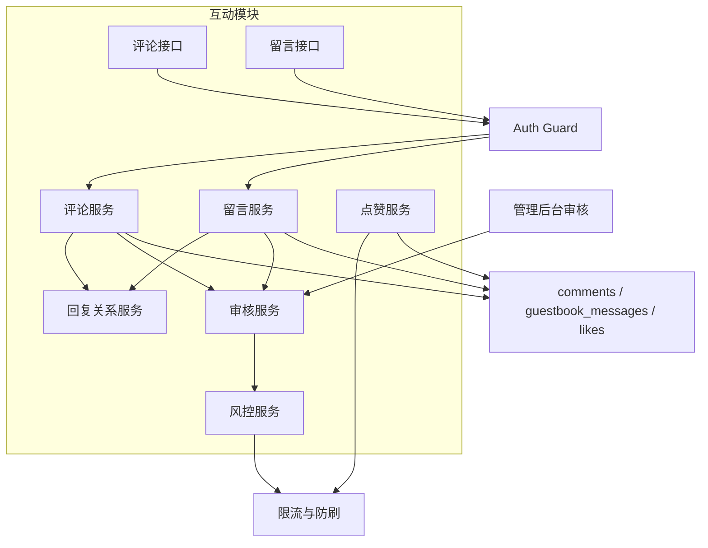
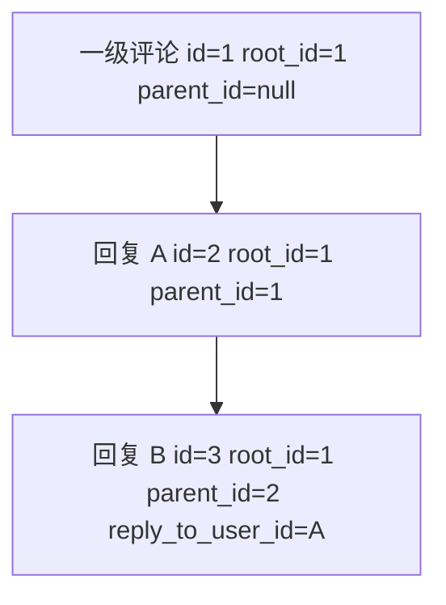
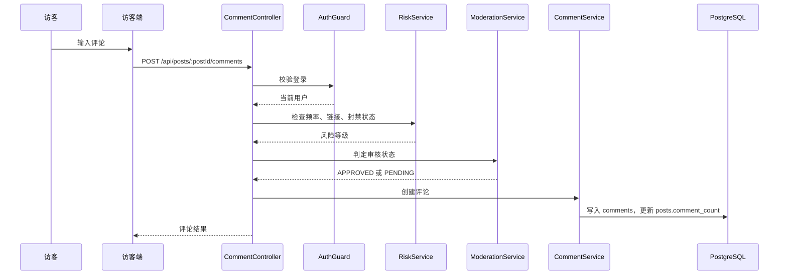
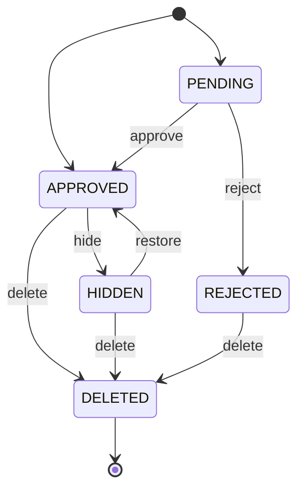
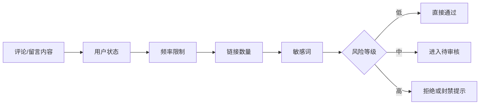
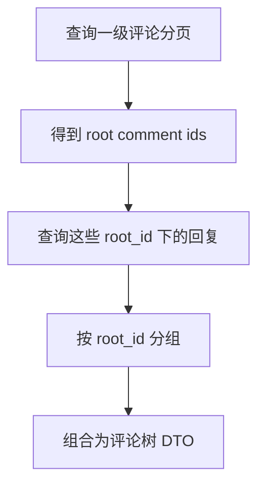

# 评论与留言模块设计

## 1. 模块目标

评论与留言模块负责访客互动，包括文章评论、评论回复、留言板、留言回复、点赞、审核和风控。

## 2. 模块结构

## 3. 评论和留言的关系

评论和留言很像，但业务语义不同：

- 评论依附于文章。
- 留言属于站点级互动，不依附文章。

因此推荐分表存储：

- `comments`
- `guestbook_messages`

设计原因：

- 查询路径更清晰。
- 后台管理可分开审核。
- 留言板未来可以有独立置顶、墙面展示、私密留言等规则。

## 4. 回复模型

产品上推荐展示二级回复，数据上保留多级扩展能力。

前端展示时：

- 一级评论按时间分页。
- 每条一级评论下展示若干回复。
- 即使数据允许多级，也折叠展示为二级，显示“回复 @某人”。

设计原因：

- 阅读体验更清楚。
- 查询复杂度可控。
- 避免深层嵌套导致移动端难读。

## 5. 创建评论流程

## 6. 审核状态机

状态含义：

- `PENDING`：待审核，仅自己和管理员可见。
- `APPROVED`：公开展示。
- `REJECTED`：审核拒绝。
- `HIDDEN`：管理员隐藏，可恢复。
- `DELETED`：软删除。

## 7. 风控策略

MVP 规则：

- 被封禁用户不能提交。
- 60 秒内同一用户最多提交 3 次。
- 同一 IP 短时间高频进入待审核。
- 内容包含多个链接进入待审核。
- 命中敏感词进入待审核或拒绝。

## 8. 点赞设计

点赞统一表：

- `target_type`: `POST` / `COMMENT` / `MESSAGE`
- `target_id`: 目标 ID
- `user_id`: 点赞用户

唯一索引：

- `(user_id, target_type, target_id)`

设计原因：

- 一张表支持多种目标。
- 唯一索引天然防重复点赞。
- 目标表保留 `like_count` 冗余，读列表更快。

## 9. 查询设计

评论列表推荐两阶段查询：

设计原因：

- 避免一次性加载大量评论。
- 一级评论分页稳定。
- 回复可以限制每条展示数量，剩余按需展开。

## 10. 接口草案

| 方法 | 路径 | 说明 |
| --- | --- | --- |
| `GET` | `/api/posts/:postId/comments` | 文章评论列表 |
| `POST` | `/api/posts/:postId/comments` | 创建文章评论 |
| `POST` | `/api/comments/:id/replies` | 回复评论 |
| `DELETE` | `/api/comments/:id` | 删除自己的评论 |
| `GET` | `/api/guestbook/messages` | 留言列表 |
| `POST` | `/api/guestbook/messages` | 创建留言 |
| `POST` | `/api/guestbook/messages/:id/replies` | 回复留言 |
| `POST` | `/api/likes` | 点赞 |
| `DELETE` | `/api/likes` | 取消点赞 |
| `GET` | `/api/admin/comments` | 后台评论列表 |
| `PATCH` | `/api/admin/comments/:id/status` | 审核评论 |

## 11. 设计取舍

### 11.1 为什么评论必须登录

登录能减少垃圾评论，便于封禁、通知和历史追踪。邮箱验证码登录已经足够轻，不会明显增加互动门槛。

### 11.2 为什么默认二级展示

博客评论区不是论坛，二级展示更符合阅读体验，也更容易做好移动端样式。

### 11.3 为什么审核和删除都做软状态

互动内容可能涉及争议、误删、申诉和审计。软删除可以保留治理记录，也能保持计数和关系处理更稳。

## 12. 后续演进

- 评论回复邮件通知。
- 管理员评论置顶。
- Akismet 或第三方反垃圾服务。
- 评论导出。
- 私密留言。
- 评论 Markdown 子集。
