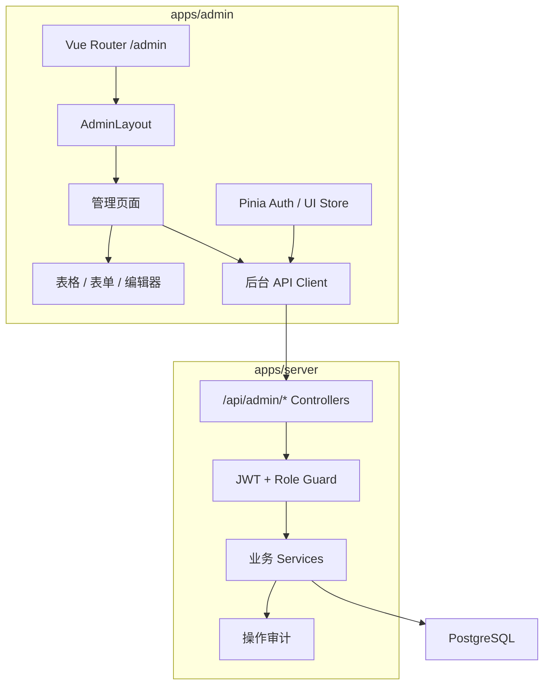
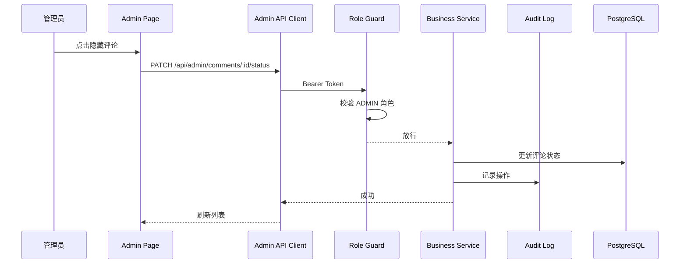
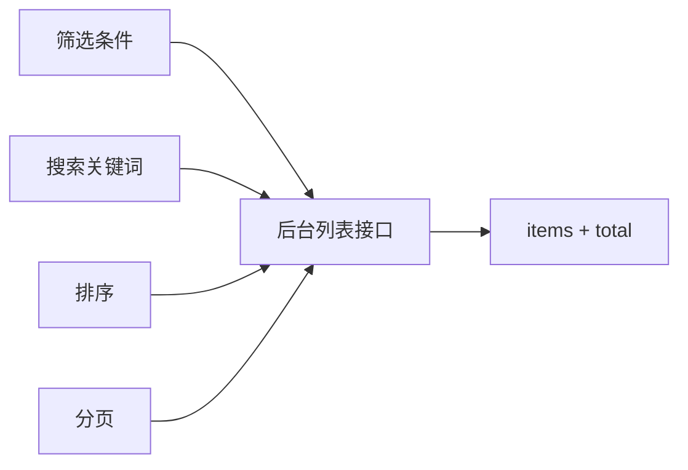
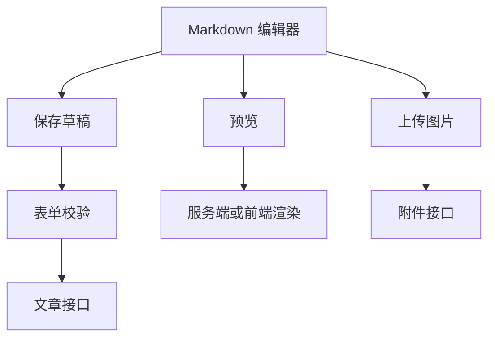

# 管理后台模块设计

## 1. 模块目标

管理后台用于博主和管理员维护站点内容、审核互动、管理访客、调整配置并查看数据概览。它强调效率、可治理和可追溯。

## 2. 架构图

## 3. 页面模块

| 页面 | 路由 | 主要能力 |
| --- | --- | --- |
| 登录 | `/admin/login` | 管理员登录 |
| 仪表盘 | `/admin` | 数据概览 |
| 文章管理 | `/admin/posts` | 列表、筛选、发布状态 |
| 文章编辑 | `/admin/posts/new`, `/admin/posts/:id/edit` | Markdown 编辑、保存、发布 |
| 分类管理 | `/admin/categories` | 分类 CRUD |
| 标签管理 | `/admin/tags` | 标签 CRUD |
| 评论管理 | `/admin/comments` | 审核、隐藏、删除 |
| 留言管理 | `/admin/guestbook` | 审核、回复、删除 |
| 访客管理 | `/admin/users` | 封禁、查看互动记录 |
| 系统设置 | `/admin/settings` | 站点信息、SEO、社交链接 |

## 4. 后台请求链路

## 5. 权限设计

后台接口统一使用 `/api/admin/*` 前缀，并要求：

- 必须登录。
- 用户状态为 `ACTIVE`。
- 角色为 `ADMIN` 或 `SUPER_ADMIN`。

超管特权：

- 管理管理员账号。
- 修改系统关键配置。
- 查看更多审计记录。

设计原因：

- 路由前缀让权限边界更清楚。
- 后台接口不会被访客端误用。
- 后续接入菜单权限时可以在这个基础上扩展。

## 6. 表格查询模式

所有后台列表建议统一支持：

- `page`
- `pageSize`
- `keyword`
- `status`
- `sortBy`
- `sortOrder`

设计原因：

- 页面行为一致。
- 后端分页避免大数据量卡顿。
- 便于抽象通用列表组件。

## 7. 文章编辑器设计

编辑器应包含：

- 标题。
- 摘要。
- 封面。
- 分类。
- 标签。
- Markdown 正文。
- 是否允许评论。
- 保存草稿。
- 发布。
- 预览。

## 8. 操作审计

建议记录以下后台操作：

- 登录成功/失败。
- 发布文章。
- 删除文章。
- 审核评论。
- 隐藏留言。
- 封禁用户。
- 修改系统设置。

审计字段：

- 操作者 ID。
- 操作类型。
- 目标类型。
- 目标 ID。
- 操作前后状态。
- IP 哈希。
- 时间。

## 9. 设计取舍

### 9.1 为什么使用 Element Plus

后台需要大量表格、表单、弹窗、分页、确认框。Element Plus 生态成熟，能快速完成运营型页面，避免把时间耗在基础组件上。

### 9.2 为什么管理端独立部署

管理端和访客端的视觉、依赖、权限、缓存策略都不同。独立应用更容易控制包体积，也方便后续单独加安全策略。

### 9.3 为什么需要操作审计

评论审核、用户封禁、内容删除都可能需要回溯。审计日志不是 MVP 必做，但架构上要预留。

## 10. 后续演进

- 基于角色的细粒度权限。
- 操作审计页面。
- 文章版本历史。
- 数据统计图表。
- 快捷键和自动保存。
- 评论审核批量操作。
