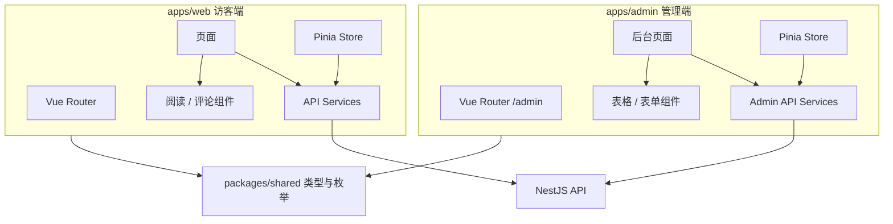
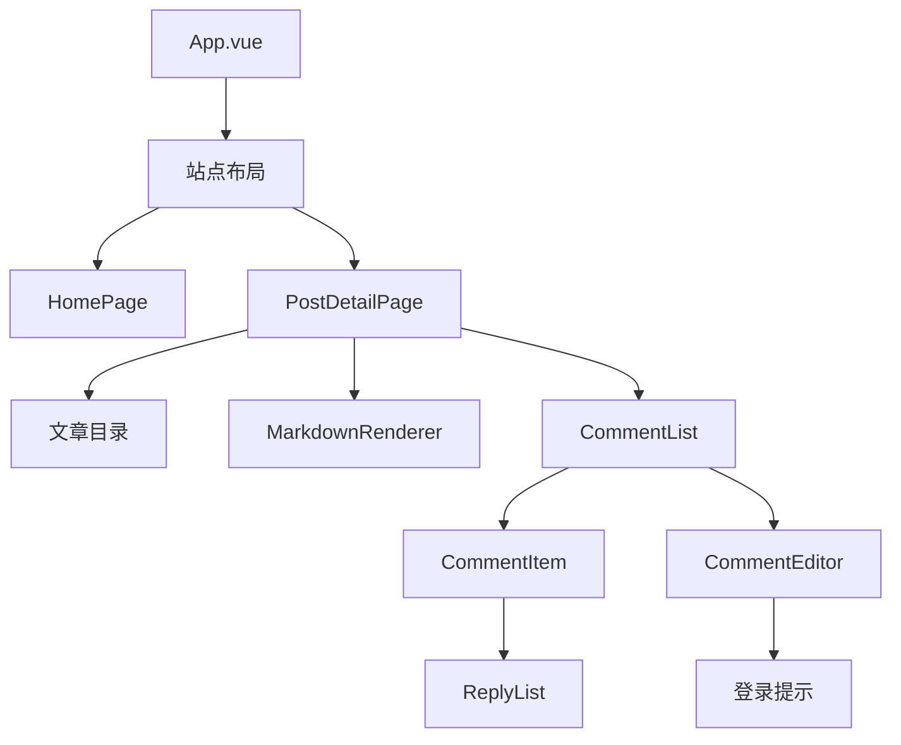
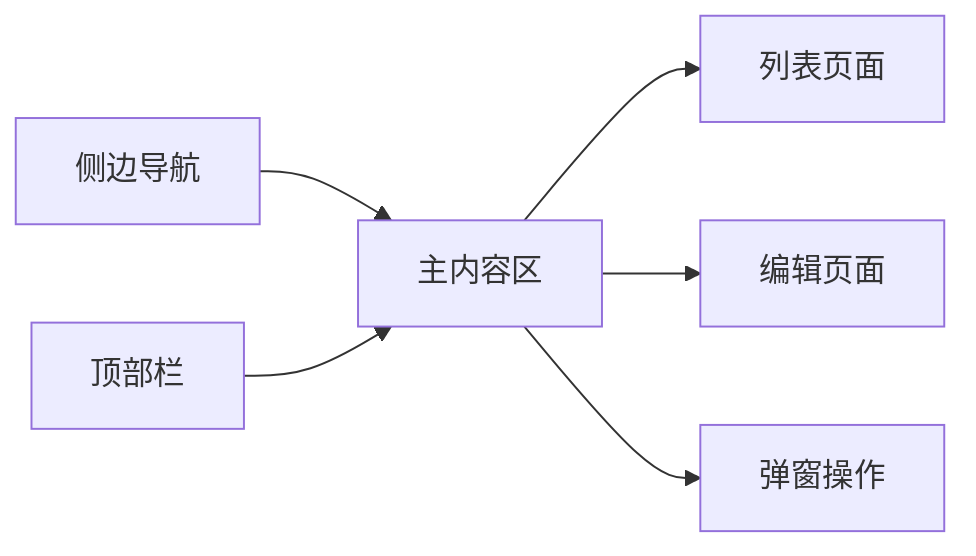
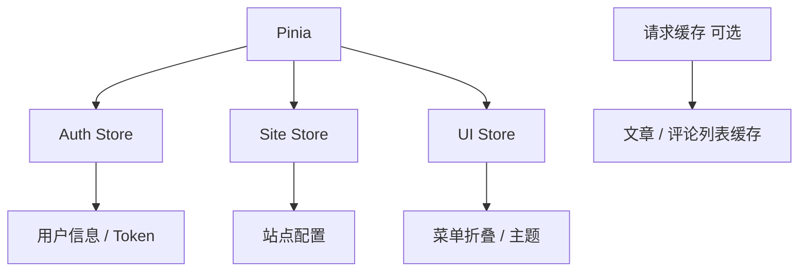
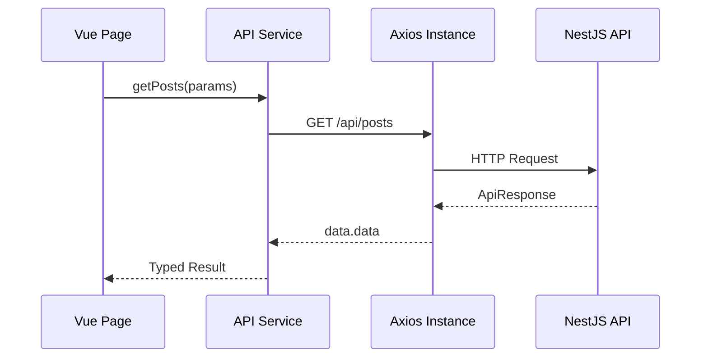
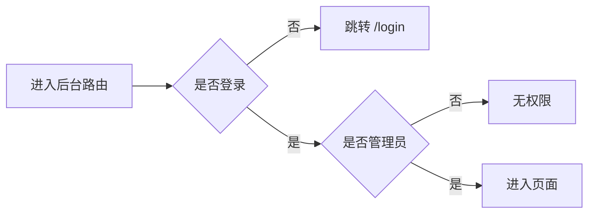

# 前端应用架构设计

## 1. 模块目标

前端分为访客端 `apps/web` 和管理后台 `apps/admin`。访客端强调阅读体验与互动，管理端强调效率和治理。

## 2. 总体架构

## 3. 访客端设计

### 3.1 页面结构

| 页面 | 路由 | 职责 |
| --- | --- | --- |
| 首页 | `/` | 最新文章、推荐入口 |
| 文章详情 | `/posts/:slug` | 正文、目录、评论 |
| 归档 | `/archives` | 时间线 |
| 留言板 | `/guestbook` | 留言和回复 |
| 关于 | `/about` | 个人介绍 |
| 搜索 | `/search` | 关键词搜索 |

### 3.2 访客端组件层级

### 3.3 设计原因

- 阅读相关组件独立，方便未来迁移到 Nuxt。
- 评论编辑器独立，文章评论和留言回复可复用。
- API 调用集中在 `services`，避免页面里散落请求细节。
- `packages/shared` 统一枚举和 DTO 类型，减少前后端字段漂移。

## 4. 管理端设计

### 4.1 页面结构

管理端使用固定侧边栏布局：

### 4.2 管理端组件建议

- `AdminLayout`
- `PageHeader`
- `DataTable`
- `StatusTag`
- `ConfirmAction`
- `PostEditor`
- `CommentModerationDialog`
- `UserStatusSelect`

设计原因：

- 后台大量页面都是筛选、表格、操作按钮、分页，抽象通用组件能减少重复。
- 评论审核、用户封禁等危险操作应通过统一确认组件处理。

## 5. 状态管理

建议：

- 登录态放 `AuthStore`。
- 站点标题、头像、社交链接放 `SiteStore`。
- 后台菜单折叠、主题放 `UiStore`。
- 远程列表数据优先用请求缓存库，或先用简单 `services + ref`。

## 6. API Client 设计

统一处理：

- baseURL。
- 超时。
- Access Token 注入。
- 401 刷新 Token。
- 错误提示。
- 统一解包 `ApiResponse<T>`。

## 7. 路由与权限

访客端：

- 大多数页面无需登录。
- 评论、留言、点赞操作触发登录弹窗。

管理端：

- `/admin/login` 无需登录。
- 其他 `/admin/*` 页面必须登录。
- 路由守卫检查用户角色。

## 8. 样式策略

访客端：

- 定制化 CSS 或 UnoCSS/Tailwind。
- 强调阅读排版、移动端体验、正文可读性。

管理端：

- Element Plus。
- 控制页面密度。
- 表格、表单优先可扫描和可操作。

## 9. 设计取舍

### 9.1 为什么访客端不用组件库为主

博客访客端需要自己的气质和阅读体验，组件库容易显得后台化。访客端只在必要时使用轻量组件。

### 9.2 为什么管理端使用组件库

管理端是生产力工具，稳定、统一、快速实现比视觉个性更重要。

### 9.3 为什么共享类型独立成包

登录角色、文章状态、分页结果、接口 DTO 都会被前后端同时使用。共享包能减少重复定义和字段不一致。

## 10. 后续演进

- 访客端迁移 Nuxt 3。
- 接入 TanStack Query。
- Markdown 组件支持目录同步高亮。
- 评论组件完整复用到留言板。
- 后台列表组件抽象。
- 暗色主题。
