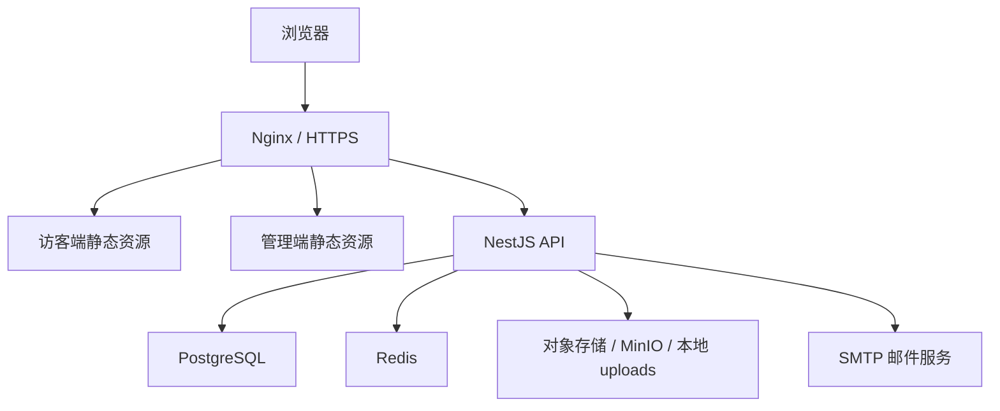
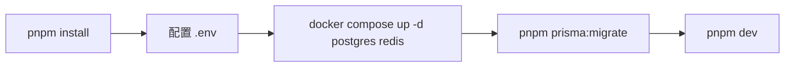
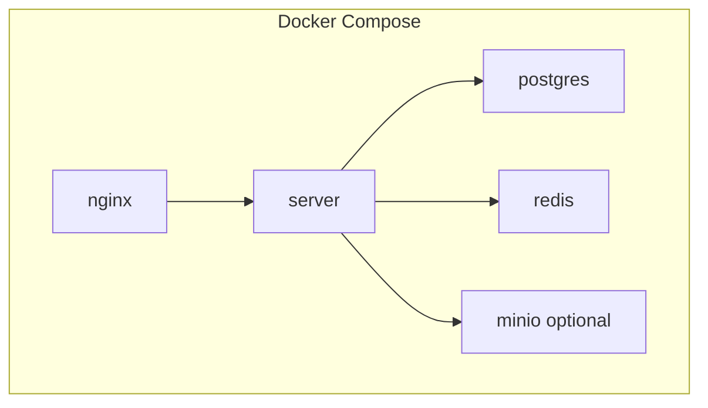
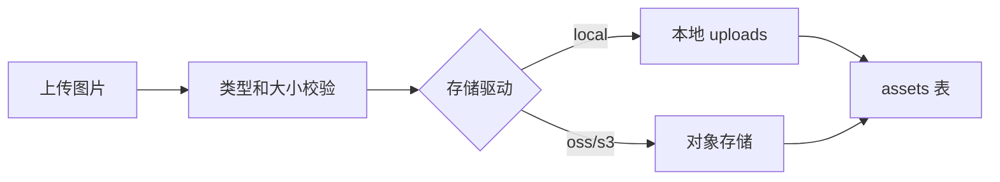
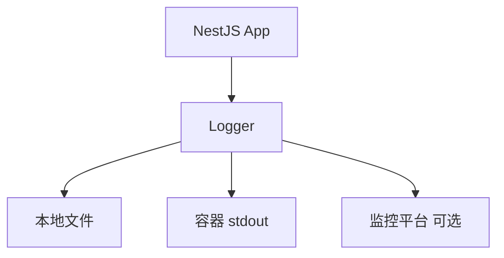

# 基础设施与部署模块设计

## 1. 模块目标

基础设施模块负责本地开发、生产部署、数据库、缓存、对象存储、Nginx、HTTPS、日志、备份和运行监控。

## 2. 部署架构



## 3. 本地开发环境

| 服务 | 地址 |
| --- | --- |
| 访客端 | `http://localhost:5173` |
| 管理后台 | `http://localhost:5174/admin/` |
| 后端 API | `http://localhost:3000/api` |
| Swagger | `http://localhost:3000/docs` |
| PostgreSQL | `localhost:5432` |
| Redis | `localhost:6379` |

本地启动流程：



## 4. 生产环境路径规划

```text
https://your-domain.com/          访客端
https://your-domain.com/admin/    管理后台
https://your-domain.com/api/      后端接口
https://your-domain.com/uploads/  本地上传资源，可选
```

Nginx 规则：

- `/` 指向 `apps/web/dist`。
- `/admin/` 指向 `apps/admin/dist`。
- `/api/` 反向代理 `server:3000`。
- `/uploads/` 指向本地文件目录或代理对象存储。

## 5. Docker Compose 设计

当前 `docker-compose.yml` 先包含：

- PostgreSQL。
- Redis。

后续可增加：

- `server`。
- `nginx`。
- `minio`。
- `backup`。



设计原因：

- MVP 阶段先保证数据库和 Redis 依赖一致。
- 前后端开发服务由本机启动，调试更方便。
- 生产阶段再把 `server` 和 `nginx` 纳入 Compose。

## 6. 配置管理

配置来源：

- `.env.example`：模板。
- `.env`：本地私有配置。
- 生产环境变量：由服务器或容器平台注入。

关键配置：

- `DATABASE_URL`
- `REDIS_URL`
- `JWT_ACCESS_SECRET`
- `JWT_REFRESH_SECRET`
- `MAIL_FROM`
- `STORAGE_DRIVER`
- `PUBLIC_SITE_URL`

设计原因：

- 敏感信息不入库、不提交。
- 各环境通过环境变量区分。
- 配置项集中，便于部署排查。

## 7. 文件与对象存储



MVP：

- 本地 `uploads`。
- 数据库存 `assets` 元数据。

生产推荐：

- 对象存储。
- CDN。
- 图片压缩和格式转换。

## 8. 日志与监控

建议日志分层：

- HTTP access log。
- 应用业务日志。
- 错误日志。
- 管理员操作审计。



MVP 可先用 console 和文件日志，后续接入 Loki、Grafana、Sentry。

## 9. 备份策略

必须备份：

- PostgreSQL 数据。
- 上传文件或对象存储。
- `.env` 生产配置，单独安全保存。

备份建议：

- 每日自动数据库备份。
- 保留最近 7 天每日备份。
- 每月保留一个长期备份。
- 定期演练恢复。

## 10. 安全部署要点

- 生产必须启用 HTTPS。
- 管理后台可加额外路径保护或 IP 白名单。
- JWT secret 使用强随机值。
- 数据库不暴露公网。
- Redis 不暴露公网。
- 上传文件限制类型和大小。
- Nginx 设置请求体大小限制。
- 后端接口设置限流。

## 11. 后续演进

- GitHub Actions 自动部署。
- 蓝绿部署。
- 数据库迁移流水线。
- Sentry 前后端异常监控。
- CDN。
- 自动备份和恢复脚本。
