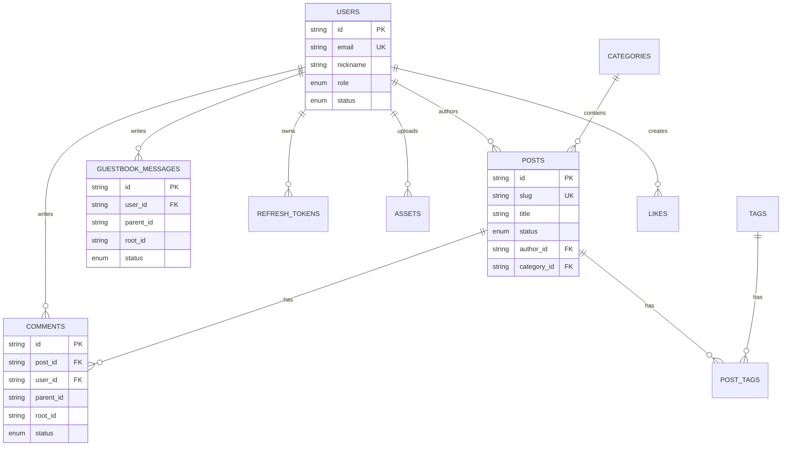
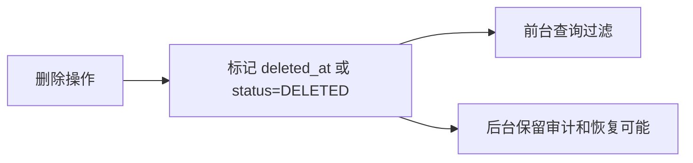
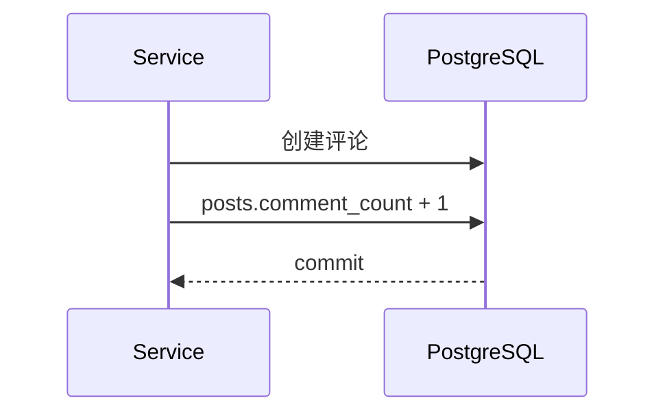
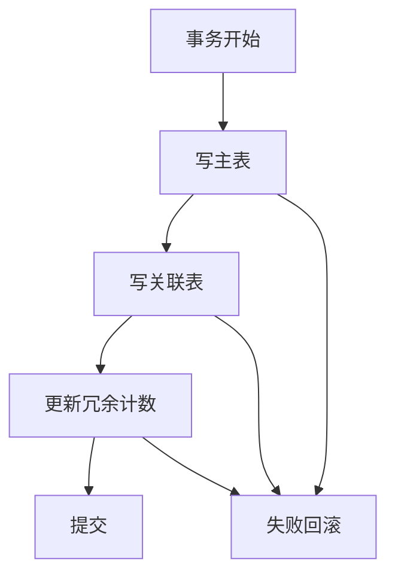

# 数据库与数据一致性设计

## 1. 模块目标

数据库设计用于支撑文章内容、用户身份、评论留言、点赞、附件和站点配置。设计重点是关系清晰、查询高效、可审计、可扩展。

## 2. 核心 ER 图



## 3. 表分组

### 3.1 身份与认证

- `users`
- `refresh_tokens`
- `email_verification_codes`

### 3.2 内容

- `posts`
- `categories`
- `tags`
- `post_tags`

### 3.3 互动

- `comments`
- `guestbook_messages`
- `likes`

### 3.4 系统资源

- `assets`
- `site_settings`

## 4. 主键策略

当前 Prisma schema 使用 `cuid()` 字符串主键。

设计原因：

- 前端和后端都容易处理。
- 不暴露自增 ID 规模。
- 适合未来分布式或导入数据。

取舍：

- 字符串索引比 bigint 稍大。
- 对个人博客规模来说影响很小。

## 5. 软删除策略

文章、评论、留言使用 `deleted_at` 或状态软删除。



设计原因：

- 避免误删。
- 保留审核和治理记录。
- 不破坏回复树和计数统计。

## 6. 计数字段设计

冗余计数字段：

- `posts.view_count`
- `posts.like_count`
- `posts.comment_count`
- `comments.like_count`
- `guestbook_messages.like_count`
- `categories.post_count`
- `tags.post_count`



设计原因：

- 列表查询无需实时 count。
- 个人博客读多写少，写入时维护冗余更划算。

一致性策略：

- MVP 可在事务里同步更新。
- 后续可定时校准计数字段。
- 高并发阅读量可先写 Redis，再批量回写。

## 7. 事务边界

需要事务的场景：

- 创建文章并写入标签关联。
- 发布文章并更新分类/标签计数。
- 创建评论并更新文章评论数。
- 删除评论并更新评论数。
- 点赞并更新目标点赞数。
- 删除文章并清理关联关系。



## 8. 索引设计

关键索引：

| 表 | 索引 | 用途 |
| --- | --- | --- |
| `users` | `email` | 邮箱登录 |
| `users` | `(provider, provider_id)` | OAuth 登录 |
| `posts` | `slug` | 文章详情 |
| `posts` | `(status, published_at)` | 访客列表 |
| `posts` | `category_id` | 分类文章 |
| `comments` | `(post_id, status, created_at)` | 文章评论列表 |
| `comments` | `(root_id, status, created_at)` | 回复列表 |
| `guestbook_messages` | `(root_id, status, created_at)` | 留言回复 |
| `likes` | `(user_id, target_type, target_id)` | 防重复点赞 |

## 9. 查询模式

### 9.1 文章列表

```sql
WHERE status = 'PUBLISHED'
  AND visibility = 'PUBLIC'
  AND deleted_at IS NULL
ORDER BY is_top DESC, published_at DESC
LIMIT ? OFFSET ?
```

### 9.2 评论列表

```sql
WHERE post_id = ?
  AND status = 'APPROVED'
  AND parent_id IS NULL
ORDER BY created_at DESC
LIMIT ? OFFSET ?
```

### 9.3 回复列表

```sql
WHERE root_id IN (...)
  AND status = 'APPROVED'
ORDER BY created_at ASC
```

## 10. 数据安全

- 密码只存哈希。
- Refresh Token 只存哈希。
- IP 存 hash，不直接存明文。
- 评论内容服务端清洗。
- 后台敏感操作记录审计。
- 数据库连接账号使用最小权限。

## 11. 迁移策略

使用 Prisma migration：

```bash
pnpm prisma:migrate
```

原则：

- 每个业务迭代一个 migration。
- 避免手改生产数据库结构。
- 迁移前备份。
- 高风险字段删除分两步：先停用，再删除。

## 12. 后续演进

- 增加 `audit_logs` 表。
- 增加 `post_versions` 表。
- 增加 `notifications` 表。
- 增加全文搜索索引。
- 计数异步化。
- 数据备份脚本。
