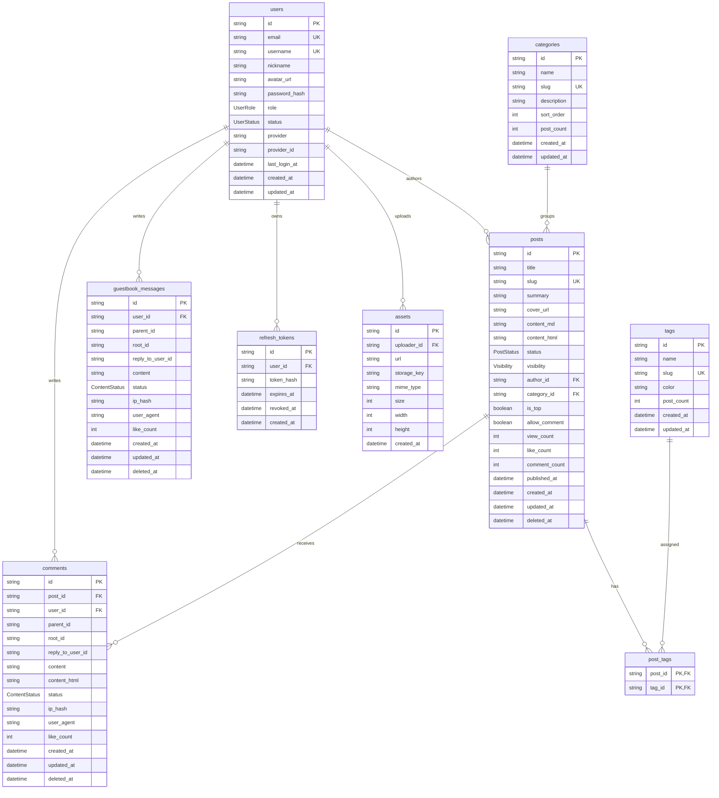

# 当前数据库表设计详解

本文档基于当前代码中的 `prisma/schema.prisma` 编写，描述现阶段实际存在的表、字段、关系和使用方式。它关注“现在项目真的建了哪些表”，而不是远期规划。

## 总览

当前数据库使用 PostgreSQL，表结构由 Prisma 管理。Prisma 模型文件位置：

```text
prisma/schema.prisma
```

当前一共有 12 张业务表：

| Prisma Model | 数据库表名 | 作用 |
| --- | --- | --- |
| `User` | `users` | 用户、作者、管理员、访客身份 |
| `Post` | `posts` | 文章主体 |
| `Category` | `categories` | 文章分类 |
| `Tag` | `tags` | 文章标签 |
| `PostTag` | `post_tags` | 文章与标签的多对多关系 |
| `Comment` | `comments` | 文章评论 |
| `GuestbookMessage` | `guestbook_messages` | 留言板消息 |
| `Like` | `likes` | 点赞记录 |
| `RefreshToken` | `refresh_tokens` | 登录刷新令牌 |
| `EmailVerificationCode` | `email_verification_codes` | 邮箱验证码 |
| `Asset` | `assets` | 上传资源 |
| `SiteSetting` | `site_settings` | 站点配置 |

其中当前只读博客 MVP 主要使用：

- `users`
- `posts`
- `categories`
- `tags`
- `post_tags`

评论、留言、点赞、登录令牌、验证码、上传资源和站点配置属于后续功能预留。

## ER 关系图



说明：

- `likes` 是多态点赞表，使用 `target_type + target_id` 指向不同目标，因此图中没有画固定外键。
- `email_verification_codes` 按邮箱保存验证码，不直接关联 `users`。
- `site_settings` 是 key-value 配置表，不依赖其他表。
- `comments.parent_id`、`comments.root_id`、`guestbook_messages.parent_id`、`guestbook_messages.root_id` 当前只是普通字段，没有声明数据库级自关联外键。

## 核心内容模型

### `posts` 文章表

`posts` 是博客最核心的表，一条记录代表一篇文章。

| 字段 | 数据库列 | 类型 | 说明 |
| --- | --- | --- | --- |
| `id` | `id` | `String` | 主键，默认 `cuid()` |
| `title` | `title` | `String` | 文章标题 |
| `slug` | `slug` | `String` | 文章 URL 标识，唯一 |
| `summary` | `summary` | `String?` | 摘要 |
| `coverUrl` | `cover_url` | `String?` | 封面图地址 |
| `contentMd` | `content_md` | `String` | Markdown 正文 |
| `contentHtml` | `content_html` | `String?` | Markdown 渲染后的 HTML |
| `status` | `status` | `PostStatus` | 文章状态 |
| `visibility` | `visibility` | `Visibility` | 可见性 |
| `authorId` | `author_id` | `String` | 作者用户 ID |
| `categoryId` | `category_id` | `String?` | 分类 ID，可为空 |
| `isTop` | `is_top` | `Boolean` | 是否置顶 |
| `allowComment` | `allow_comment` | `Boolean` | 是否允许评论 |
| `viewCount` | `view_count` | `Int` | 阅读数 |
| `likeCount` | `like_count` | `Int` | 点赞数 |
| `commentCount` | `comment_count` | `Int` | 评论数 |
| `publishedAt` | `published_at` | `DateTime?` | 发布时间 |
| `createdAt` | `created_at` | `DateTime` | 创建时间 |
| `updatedAt` | `updated_at` | `DateTime` | 更新时间 |
| `deletedAt` | `deleted_at` | `DateTime?` | 软删除时间 |

当前前台只显示满足以下条件的文章：

```text
status = PUBLISHED
visibility = PUBLIC
published_at IS NOT NULL
deleted_at IS NULL
```

关键约束和索引：

- `slug` 唯一，用于 `/posts/:slug` 详情页。
- `(status, published_at)` 索引用于公开文章列表和归档排序。
- `author_id`、`category_id` 有索引，便于按作者或分类查询。

### `categories` 分类表

`categories` 用于给文章做单一归类。一篇文章最多属于一个分类，一个分类可以包含多篇文章。

| 字段 | 数据库列 | 类型 | 说明 |
| --- | --- | --- | --- |
| `id` | `id` | `String` | 主键 |
| `name` | `name` | `String` | 分类名称 |
| `slug` | `slug` | `String` | 分类 URL 标识，唯一 |
| `description` | `description` | `String?` | 分类说明 |
| `sortOrder` | `sort_order` | `Int` | 排序值 |
| `postCount` | `post_count` | `Int` | 公开文章数量缓存 |
| `createdAt` | `created_at` | `DateTime` | 创建时间 |
| `updatedAt` | `updated_at` | `DateTime` | 更新时间 |

当前 Markdown 导入脚本会根据 frontmatter 中的 `category` 自动创建或更新分类，并重新计算 `postCount`。

### `tags` 标签表

`tags` 用于给文章打多个标签。一篇文章可以有多个标签，一个标签也可以属于多篇文章。

| 字段 | 数据库列 | 类型 | 说明 |
| --- | --- | --- | --- |
| `id` | `id` | `String` | 主键 |
| `name` | `name` | `String` | 标签名称 |
| `slug` | `slug` | `String` | 标签 URL 标识，唯一 |
| `color` | `color` | `String?` | 标签颜色 |
| `postCount` | `post_count` | `Int` | 公开文章数量缓存 |
| `createdAt` | `created_at` | `DateTime` | 创建时间 |
| `updatedAt` | `updated_at` | `DateTime` | 更新时间 |

当前 Markdown 导入脚本会根据 frontmatter 中的 `tags` 自动创建或更新标签，并重新计算 `postCount`。

### `post_tags` 文章标签关联表

`post_tags` 是 `posts` 和 `tags` 的多对多中间表。

| 字段 | 数据库列 | 类型 | 说明 |
| --- | --- | --- | --- |
| `postId` | `post_id` | `String` | 文章 ID |
| `tagId` | `tag_id` | `String` | 标签 ID |

关键约束：

- 复合主键：`(post_id, tag_id)`，避免同一篇文章重复绑定同一个标签。
- 删除文章时，对应关联记录级联删除。
- 删除标签时，对应关联记录级联删除。

## 用户与认证模型

### `users` 用户表

`users` 同时承载管理员、作者和访客身份。

| 字段 | 数据库列 | 类型 | 说明 |
| --- | --- | --- | --- |
| `id` | `id` | `String` | 主键 |
| `email` | `email` | `String?` | 邮箱，唯一 |
| `username` | `username` | `String?` | 用户名，唯一 |
| `nickname` | `nickname` | `String` | 昵称 |
| `avatarUrl` | `avatar_url` | `String?` | 头像地址 |
| `passwordHash` | `password_hash` | `String?` | 密码哈希 |
| `role` | `role` | `UserRole` | 角色 |
| `status` | `status` | `UserStatus` | 用户状态 |
| `provider` | `provider` | `String?` | 第三方登录提供方 |
| `providerId` | `provider_id` | `String?` | 第三方账号 ID |
| `lastLoginAt` | `last_login_at` | `DateTime?` | 最近登录时间 |
| `createdAt` | `created_at` | `DateTime` | 创建时间 |
| `updatedAt` | `updated_at` | `DateTime` | 更新时间 |

关键约束和索引：

- `email` 唯一。
- `username` 唯一。
- `(provider, provider_id)` 唯一，用于第三方登录账号绑定。
- `status` 有索引，用于筛选正常、封禁或删除用户。

### `refresh_tokens` 刷新令牌表

用于登录态刷新。

| 字段 | 数据库列 | 类型 | 说明 |
| --- | --- | --- | --- |
| `id` | `id` | `String` | 主键 |
| `userId` | `user_id` | `String` | 用户 ID |
| `tokenHash` | `token_hash` | `String` | refresh token 哈希 |
| `expiresAt` | `expires_at` | `DateTime` | 过期时间 |
| `revokedAt` | `revoked_at` | `DateTime?` | 吊销时间 |
| `createdAt` | `created_at` | `DateTime` | 创建时间 |

关系：

- `refresh_tokens.user_id -> users.id`
- 删除用户时，对应 refresh token 级联删除。

### `email_verification_codes` 邮箱验证码表

用于登录、绑定邮箱、重置密码等邮箱验证码场景。

| 字段 | 数据库列 | 类型 | 说明 |
| --- | --- | --- | --- |
| `id` | `id` | `String` | 主键 |
| `email` | `email` | `String` | 邮箱 |
| `codeHash` | `code_hash` | `String` | 验证码哈希 |
| `scene` | `scene` | `EmailCodeScene` | 使用场景 |
| `expiresAt` | `expires_at` | `DateTime` | 过期时间 |
| `usedAt` | `used_at` | `DateTime?` | 使用时间 |
| `createdAt` | `created_at` | `DateTime` | 创建时间 |

关键索引：

- `(email, scene)`，便于查找某个邮箱在某个场景下的验证码。

## 互动模型

### `comments` 评论表

`comments` 用于文章评论和评论回复。

| 字段 | 数据库列 | 类型 | 说明 |
| --- | --- | --- | --- |
| `id` | `id` | `String` | 主键 |
| `postId` | `post_id` | `String` | 所属文章 ID |
| `userId` | `user_id` | `String` | 评论用户 ID |
| `parentId` | `parent_id` | `String?` | 父评论 ID |
| `rootId` | `root_id` | `String?` | 根评论 ID |
| `replyToUserId` | `reply_to_user_id` | `String?` | 被回复用户 ID |
| `content` | `content` | `String` | 评论内容 |
| `contentHtml` | `content_html` | `String?` | 渲染后的评论 HTML |
| `status` | `status` | `ContentStatus` | 审核状态 |
| `ipHash` | `ip_hash` | `String?` | IP 哈希 |
| `userAgent` | `user_agent` | `String?` | 浏览器 UA |
| `likeCount` | `like_count` | `Int` | 点赞数 |
| `createdAt` | `created_at` | `DateTime` | 创建时间 |
| `updatedAt` | `updated_at` | `DateTime` | 更新时间 |
| `deletedAt` | `deleted_at` | `DateTime?` | 软删除时间 |

关系：

- `comments.post_id -> posts.id`
- `comments.user_id -> users.id`
- 删除文章时，对应评论级联删除。

当前注意点：

- `parent_id`、`root_id`、`reply_to_user_id` 没有声明数据库外键。
- 这让树形回复更灵活，但也意味着应用层需要维护引用有效性。

### `guestbook_messages` 留言表

`guestbook_messages` 用于留言板消息和留言回复。

字段结构与评论类似，但不绑定文章。

| 字段 | 数据库列 | 类型 | 说明 |
| --- | --- | --- | --- |
| `id` | `id` | `String` | 主键 |
| `userId` | `user_id` | `String` | 留言用户 ID |
| `parentId` | `parent_id` | `String?` | 父留言 ID |
| `rootId` | `root_id` | `String?` | 根留言 ID |
| `replyToUserId` | `reply_to_user_id` | `String?` | 被回复用户 ID |
| `content` | `content` | `String` | 留言内容 |
| `status` | `status` | `ContentStatus` | 审核状态 |
| `ipHash` | `ip_hash` | `String?` | IP 哈希 |
| `userAgent` | `user_agent` | `String?` | 浏览器 UA |
| `likeCount` | `like_count` | `Int` | 点赞数 |
| `createdAt` | `created_at` | `DateTime` | 创建时间 |
| `updatedAt` | `updated_at` | `DateTime` | 更新时间 |
| `deletedAt` | `deleted_at` | `DateTime?` | 软删除时间 |

关系：

- `guestbook_messages.user_id -> users.id`

### `likes` 点赞表

`likes` 用于记录用户对不同对象的点赞。

| 字段 | 数据库列 | 类型 | 说明 |
| --- | --- | --- | --- |
| `id` | `id` | `String` | 主键 |
| `userId` | `user_id` | `String` | 用户 ID |
| `targetType` | `target_type` | `LikeTargetType` | 点赞目标类型 |
| `targetId` | `target_id` | `String` | 点赞目标 ID |
| `createdAt` | `created_at` | `DateTime` | 创建时间 |

关键约束：

- `(user_id, target_type, target_id)` 唯一，避免同一用户重复点赞同一对象。

当前注意点：

- `likes.user_id` 没有声明到 `users.id` 的外键。
- `target_id` 是多态字段，根据 `target_type` 指向文章、评论或留言，数据库层没有固定外键。

## 资源与配置模型

### `assets` 上传资源表

用于记录上传文件。

| 字段 | 数据库列 | 类型 | 说明 |
| --- | --- | --- | --- |
| `id` | `id` | `String` | 主键 |
| `uploaderId` | `uploader_id` | `String?` | 上传者用户 ID |
| `url` | `url` | `String` | 访问地址 |
| `storageKey` | `storage_key` | `String` | 存储 key |
| `mimeType` | `mime_type` | `String` | MIME 类型 |
| `size` | `size` | `Int` | 文件大小 |
| `width` | `width` | `Int?` | 图片宽度 |
| `height` | `height` | `Int?` | 图片高度 |
| `createdAt` | `created_at` | `DateTime` | 创建时间 |

关系：

- `assets.uploader_id -> users.id`
- 删除用户时，上传资源保留，`uploader_id` 置空。

### `site_settings` 站点配置表

用于保存站点级配置。

| 字段 | 数据库列 | 类型 | 说明 |
| --- | --- | --- | --- |
| `key` | `key` | `String` | 配置键，主键 |
| `value` | `value` | `Json` | 配置值 |
| `description` | `description` | `String?` | 配置说明 |
| `updatedAt` | `updated_at` | `DateTime` | 更新时间 |

适合保存：

- 站点名称
- SEO 默认描述
- 社交链接
- 评论策略
- 上传策略

## 枚举设计

### `UserRole`

| 值 | 说明 |
| --- | --- |
| `VISITOR` | 普通访客 |
| `ADMIN` | 管理员 |
| `SUPER_ADMIN` | 超级管理员 |

### `UserStatus`

| 值 | 说明 |
| --- | --- |
| `ACTIVE` | 正常 |
| `BANNED` | 已封禁 |
| `DELETED` | 已删除 |

### `PostStatus`

| 值 | 说明 |
| --- | --- |
| `DRAFT` | 草稿 |
| `PUBLISHED` | 已发布 |
| `ARCHIVED` | 已归档 |

### `Visibility`

| 值 | 说明 |
| --- | --- |
| `PUBLIC` | 公开 |
| `PRIVATE` | 私密 |

### `ContentStatus`

| 值 | 说明 |
| --- | --- |
| `PENDING` | 待审核 |
| `APPROVED` | 已通过 |
| `REJECTED` | 已拒绝 |
| `HIDDEN` | 已隐藏 |
| `DELETED` | 已删除 |

### `LikeTargetType`

| 值 | 说明 |
| --- | --- |
| `POST` | 文章 |
| `COMMENT` | 评论 |
| `MESSAGE` | 留言 |

### `EmailCodeScene`

| 值 | 说明 |
| --- | --- |
| `LOGIN` | 登录 |
| `BIND_EMAIL` | 绑定邮箱 |
| `RESET_PASSWORD` | 重置密码 |

## 当前 Markdown 导入如何写入这些表

当前文章源文件位于：

```text
content/posts/*.md
```

执行：

```bash
pnpm posts:import
```

或：

```bash
pnpm posts:sync
```

导入脚本会做这些事：

1. 读取 Markdown frontmatter。
2. 根据作者配置创建或更新 `users` 中的作者记录。
3. 根据 `category` 创建或更新 `categories`。
4. 根据 `tags` 创建或更新 `tags`。
5. 根据文章 `slug` 创建或更新 `posts`。
6. 重建该文章在 `post_tags` 中的标签关联。
7. 重新计算 `categories.post_count` 和 `tags.post_count`。

`posts:sync` 额外会处理数据库中没有对应 Markdown 文件的文章：

- 默认设为 `ARCHIVED`，前台不再显示。
- 如果传入 `--delete-missing`，则物理删除缺失文章。

```bash
pnpm posts:sync -- --delete-missing
```

## 前台读取文章的关键逻辑

当前后端文章列表和详情只读取公开已发布文章，核心过滤条件是：

```text
deletedAt = null
publishedAt != null
status = PUBLISHED
visibility = PUBLIC
```

因此：

- `DRAFT` 不显示。
- `ARCHIVED` 不显示。
- `PRIVATE` 不显示。
- `publishedAt` 为空不显示。
- `deletedAt` 不为空不显示。

这也是为什么 Prisma Studio 中存在的文章，不一定会出现在前台。

## 设计取舍

### 软删除与归档

`posts`、`comments`、`guestbook_messages` 都有 `deleted_at` 字段，用于支持软删除。

当前 Markdown 同步默认使用 `ARCHIVED` 隐藏文章，而不是直接写 `deleted_at` 或物理删除。这种方式更适合内容管理，因为误删文件时可以恢复。

### 分类与标签计数缓存

`categories.post_count` 和 `tags.post_count` 是冗余计数字段。好处是查询分类和标签列表时更快，代价是每次文章导入、发布、归档、删除时需要重新计算。

当前导入脚本已经在导入后重新计算这些值。

### 多态点赞

`likes` 使用 `target_type + target_id` 设计，可以同时支持文章、评论和留言点赞。它的好处是表少、扩展容易；代价是数据库不能用单个外键保证 `target_id` 一定存在，需要应用层校验。

### 评论和留言树

评论和留言都保留了 `parent_id`、`root_id` 和 `reply_to_user_id`，用于实现多级回复和会话树。但当前 schema 没有声明这些字段的外键关系，后续实现评论模块时需要决定是否补数据库级约束。
